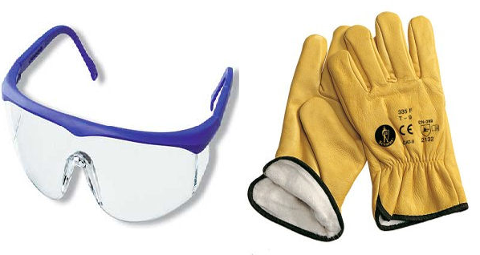

# P01. Introducción a la Fibra Óptica y sus principales medidas de protección y seguridad

## Funcionamiento

La fibra óptica es un medio de transmisión de información que utiliza cables compuestos por fibras de vidrio o plástico delgadas y flexibles para transmitir señales de luz modulada. Estas fibras están diseñadas para transmitir señales de luz de forma rápida y eficiente a través de largas distancias sin sufrir degradación de la señal.

La transmisión de información a través de fibra óptica se basa en la propiedad de la luz de reflejarse dentro de una fibra óptica. La señal de información se convierte en señales de luz mediante un dispositivo llamado modulador y se transmite a través de la fibra óptica en forma de pulsos de luz. Estos pulsos de luz viajan a través de la fibra óptica mediante reflexión interna total, es decir, la luz se refleja repetidamente dentro de la fibra óptica sin escapar al exterior.

La transmisión de información a través de fibra óptica se utiliza en una variedad de aplicaciones, ya que ofrece varias ventajas en comparación con otros medios de transmisión de información, como una mayor capacidad de ancho de banda, menor pérdida de señal, inmunidad a interferencias electromagnéticas y una mayor seguridad.

El proceso de transmisión de información a través de la fibra óptica se lleva a cabo en varias etapas, que se describen a continuación:

1. **Generación de la señal**: La información se convierte en señales eléctricas mediante un dispositivo llamado modulador. Estas señales eléctricas se utilizan para modular la luz en la fuente de luz.

        

2. **Transmisión de la señal**: Las señales de luz se transmiten a través de la fibra óptica en forma de pulsos de luz. Estos pulsos de luz se propagan a través de la fibra óptica mediante reflexión interna total.

        

3. **Recepción de la señal**: En el extremo receptor de la fibra óptica, los pulsos de luz se detectan mediante un dispositivo llamado fotodetector. El fotodetector convierte la señal óptica en una señal eléctrica.

        

4. **Amplificación de la señal**: La señal eléctrica se amplifica mediante un amplificador óptico si la señal ha sufrido una atenuación en su camino a través de la fibra óptica.

        

5. **Procesamiento de la señal**: La señal eléctrica se procesa mediante un dispositivo llamado receptor para extraer la información contenida en la señal.

6. **Entrega de la información**: Una vez que se ha procesado la señal, la información se entrega al destino final, que puede ser una computadora, un dispositivo de almacenamiento, un equipo médico o cualquier otro dispositivo que requiera la información transmitida.

## Aplicaciones

La fibra óptica es un medio de transmisión de información que tiene diversas aplicaciones en varios campos. Algunas de las aplicaciones más comunes de la fibra óptica son las siguientes:

1. **Telecomunicaciones**: La transmisión de voz, datos y video a través de la fibra óptica es la aplicación más importante actualmente de esta tecnología. Las redes de fibra óptica se utilizan para interconectar redes de telecomunicaciones de larga distancia, para conectar centros de datos y para proporcionar acceso a Internet de alta velocidad a hogares y empresas.

        

2. **Medicina**: La fibra óptica se utiliza ampliamente en la medicina para la transmisión de imágenes y datos desde y hacia equipos médicos, como endoscopios, microscopios y otros instrumentos de diagnóstico. Las fibras ópticas también se utilizan para la iluminación en instrumentos quirúrgicos y otros equipos médicos.

        

3. **Industria**: En la industria, la fibra óptica se utiliza para monitorear y controlar procesos en ambientes hostiles o peligrosos, como en la exploración de petróleo y gas, en la industria química y en la industria nuclear. La fibra óptica también se utiliza para la medición de temperaturas y otros parámetros en sistemas de calefacción, ventilación y aire acondicionado.
    
        

4. **Defensa**: La fibra óptica se utiliza en aplicaciones militares y de defensa para la transmisión de información en sistemas de comunicaciones y en la vigilancia y monitoreo de áreas críticas.

        

5. **Instrumentación científica**: En la investigación científica, la fibra óptica se utiliza en una variedad de aplicaciones, como en la medición de la presión y la temperatura en ambientes extremos, en la medición de la intensidad de la luz y en la detección de partículas.

        

En resumen, la fibra óptica tiene múltiples aplicaciones en diferentes campos, gracias a sus ventajas sobre otros medios de transmisión de información, como una mayor capacidad de ancho de banda, menor pérdida de señal, inmunidad a interferencias electromagnéticas y una mayor seguridad.

## Ventajas e Inconvenientes

La fibra óptica es un medio de transmisión de información que ofrece varios beneficios en comparación con otros medios de transmisión, como el cobre o el aire.

Algunos de los beneficios más importantes de la fibra óptica son los siguientes:

1. **Velocidad**: La fibra óptica es capaz de transmitir datos a velocidades muy altas, gracias a que utiliza la luz para transportar la información. Las velocidades de transmisión de la fibra óptica pueden llegar a ser de varias decenas de gigabits por segundo, lo que permite la transmisión de grandes cantidades de datos en muy poco tiempo.

2. **Capacidad**: La fibra óptica tiene una capacidad muy alta para transmitir datos, ya que puede transportar múltiples señales a través de una sola fibra mediante la multiplexión por frecuencia en distintas longitudes de onda (lambdas). Esto permite la transmisión de grandes cantidades de datos simultáneamente, lo que es especialmente útil en aplicaciones que requieren una gran cantidad de ancho de banda, como el streaming de video de alta definición.

3. **Inmunidad a las interferencias electromagnéticas**: La fibra óptica no es susceptible a las interferencias electromagnéticas, lo que significa que la calidad de la señal no se ve afectada por la presencia de campos electromagnéticos externos. Esto hace que la fibra óptica sea especialmente útil en aplicaciones en entornos ruidosos o en los que se requiere una alta fiabilidad de la señal, como en las telecomunicaciones.

4. **Seguridad**: La fibra óptica es muy segura, ya que es difícil de interceptar. Como la señal de la fibra óptica se transmite a través de una luz que se refleja dentro de la fibra, no hay señal radiada que pueda ser interceptada por un intruso. Además, si alguien intenta cortar la fibra, esto puede detectarse y localizarse fácilmente.

5. **Bajo mantenimiento**: La fibra óptica requiere un mantenimiento mínimo en comparación con otros medios de transmisión. Debido a que las fibras ópticas están hechas de vidrio o plástico, no se oxidan ni se corroen como los cables de cobre, lo que significa que tienen una vida útil más larga y no necesitan ser reemplazados con tanta frecuencia.

Como hemos visto, la fibra óptica ofrece varios beneficios para la transmisión de información, como una alta velocidad y capacidad de transmisión, inmunidad a las interferencias electromagnéticas, seguridad y bajo mantenimiento.

 

Aunque la fibra óptica tiene muchos beneficios en comparación con otros medios de transmisión de información, también enfrenta algunos retos y limitaciones. Algunos de los desafíos más comunes que enfrenta la fibra óptica son los siguientes:

1. **Costo y complejidad**: El costo de la instalación y mantenimiento de la fibra óptica puede ser significativamente más alto que el de otros medios de transmisión, como el cobre. Además, el proceso de instalación y configuración de la fibra óptica puede ser complicado y requiere habilidades especializadas.

2. **Susceptibilidad a daños mecánicos y ambientales**: Las fibras ópticas son delicadas y pueden dañarse fácilmente por manipulaciones bruscas, dobleces excesivos, vibraciones, golpes y otros impactos mecánicos. Además, las fibras ópticas son vulnerables a factores ambientales como la humedad, el polvo, la luz solar directa y las variaciones de temperatura, que pueden afectar su funcionamiento.

     

3. **Necesidad de equipos y herramientas especializados**: La instalación y mantenimiento de la fibra óptica requiere herramientas y equipos especializados, lo que puede aumentar los costos y la complejidad de la implementación.

     

4. **Limitaciones en la distancia de transmisión**: A medida que la señal se transmite a través de la fibra óptica, la calidad de la señal puede deteriorarse con la distancia. Esto limita la distancia de transmisión en comparación con otros medios de transmisión, como las ondas de radio. Esta limitación puede ser superada mediante el uso de repetidores.

5. **Vulnerabilidad a ataques físicos**: A pesar de su seguridad, la fibra óptica es vulnerable a ataques físicos, como la inserción de dispositivos de espionaje en los puntos de acceso a la red. Además, los cortes de fibra óptica pueden dejar fuera de servicio a grandes áreas de la red, lo que puede afectar la continuidad del servicio.

Así, aunque la fibra óptica ofrece muchos beneficios en términos de velocidad, capacidad y seguridad, también enfrenta desafíos y limitaciones, como el costo y complejidad, susceptibilidad a daños mecánicos y ambientales, necesidad de equipos y herramientas especializados, limitaciones en la distancia de transmisión y vulnerabilidad a ataques físicos. Es importante tener en cuenta estos desafíos al considerar la implementación de la fibra óptica en una red o sistema de comunicaciones.

## Futuro de la Fibra Óptica

La fibra óptica es una tecnología en constante evolución, y las tendencias actuales en su desarrollo apuntan hacia la mejora de su capacidad, velocidad y eficiencia, así como la expansión de sus aplicaciones en una variedad de industrias. Algunas de las tendencias más relevantes incluyen:

1. **Mejora de la capacidad y velocidad**: Actualmente se están desarrollando técnicas para aumentar la capacidad y velocidad de la fibra óptica, incluyendo la implementación de nuevas longitudes de onda y la utilización de técnicas de multiplexación para transmitir múltiples señales a través de una sola fibra. Además, se están desarrollando nuevas tecnologías para aumentar la velocidad de transmisión, como la fibra óptica de modo múltiple avanzada (MMF) y la fibra óptica de núcleo hueco (HC-PCF).

     

2. **Ampliación de las aplicaciones**: La fibra óptica está siendo utilizada en una variedad de industrias, incluyendo la medicina, la energía, la industria automotriz y la seguridad. Se están desarrollando nuevas aplicaciones para la fibra óptica en estas y otras industrias, como la detección de gases y la monitorización de la salud en tiempo real.

     

3. **Incorporación de tecnologías emergentes**: La inteligencia artificial y la computación cuántica son tecnologías emergentes que podrían tener un gran impacto en el desarrollo de la fibra óptica en el futuro. La inteligencia artificial podría ser utilizada para mejorar el rendimiento y la eficiencia de las redes de fibra óptica, mientras que la computación cuántica podría ayudar a mejorar la seguridad de la transmisión de datos a través de la fibra óptica.

     

4. **Desarrollo de nuevas formas de fabricación**: Actualmente se están desarrollando nuevas técnicas para fabricar la fibra óptica, incluyendo la utilización de materiales como el grafeno y la fabricación de fibras ópticas en 3D. Estas técnicas podrían mejorar la eficiencia y el rendimiento de la fibra óptica, así como reducir los costos de producción.

     

Se puede decir que la fibra óptica sigue siendo una tecnología en constante evolución, con una variedad de tendencias que apuntan hacia su mejora y expansión en el futuro.

## Tipos de Fibra óptica

Existen dos tipos principales de fibras ópticas: monomodo y multimodo.

Las fibras ópticas **monomodo** son aquellas que permiten la transmisión de una sola señal de luz en su núcleo de fibra. Esto se logra mediante la reducción del diámetro del núcleo de la fibra a un tamaño muy pequeño, de aproximadamente 8-10 micrómetros. Debido a esto, la fibra monomodo tiene una capacidad de transmisión más alta y una menor atenuación de la señal que la fibra multimodo. Esto hace que la fibra monomodo sea la elección preferida para las aplicaciones de larga distancia y alta velocidad, como la transmisión de datos a través de largas distancias en redes de telecomunicaciones.

OS1 y OS2 son los nombres que reciben en la norma TIA/EIA-568 los tipos de fibras ópticas monomodo disponibles en el mercado.

La designación **OS1** se refiere a fibras ópticas monomodo para aplicaciones de interior, con una cubierta acrílica retardante a la llama y una capacidad de transmisión de hasta 10 Gbps a una distancia máxima de 10 kilómetros.

La designación **OS2** se refiere a fibras ópticas monomodo para aplicaciones de exterior, con una cubierta de polietileno resistente a los rayos UV y una capacidad de transmisión de hasta 100 Gbps a una distancia máxima de 200 kilómetros.

En resumen, la elección entre OS1 y OS2 dependerá de la ubicación y la aplicación específica. La fibra óptica monomodo ofrece mayores distancias de transmisión y velocidades de datos más altas que las fibras ópticas multimodo, pero también son más costosas.

Por otro lado, las fibras ópticas multimodo son aquellas que permiten la transmisión de múltiples señales de luz simultáneamente a través de su núcleo de fibra, lo que se logra mediante el uso de un diámetro de núcleo más grande, típicamente de 50-62.5 micrómetros. Debido a que la fibra multimodo permite la transmisión de múltiples señales simultáneamente, es adecuada para aplicaciones de corta distancia, como la transmisión de datos en edificios y centros de datos. Sin embargo, la señal de luz puede dispersarse y atenuarse en la fibra multimodo debido a la presencia de múltiples trayectorias de transmisión, lo que limita la capacidad de transmisión y la distancia de transmisión de la fibra multimodo.

OM1, OM2, OM3, OM4 y OM5 son términos que se utilizan para describir los diferentes tipos de fibras ópticas multimodo disponibles en el mercado. Estas designaciones se basan en las especificaciones técnicas de la fibra óptica, como la longitud de onda, la velocidad de transmisión y la distancia de transmisión.

Las principales diferencias entre estos tipos de fibras ópticas son:

1. **OM1**: Es una fibra óptica multimodo de 62,5 micrómetros de diámetro y tiene una capacidad de transmisión de hasta 1 Gbps a una distancia máxima de 300 metros. Es adecuada para aplicaciones de corta distancia y baja velocidad.

2. **OM2**: Es una fibra óptica multimodo de 50 micrómetros de diámetro y tiene una capacidad de transmisión de hasta 1 Gbps a una distancia máxima de 600 metros. Es adecuada para aplicaciones de corta distancia y velocidad moderada.

3. **OM3**: Es una fibra óptica multimodo de 50 micrómetros de diámetro y tiene una capacidad de transmisión de hasta 10 Gbps a una distancia máxima de 300 metros. Es adecuada para aplicaciones de corta y media distancia y alta velocidad.

4. **OM4**: Es una fibra óptica multimodo de 50 micrómetros de diámetro y tiene una capacidad de transmisión de hasta 100 Gbps a una distancia máxima de 550 metros. Es adecuada para aplicaciones de media distancia y alta velocidad.

5. **OM5**: Es una fibra óptica multimodo de 50 micrómetros de diámetro y tiene una capacidad de transmisión de hasta 100 Gbps a una distancia máxima de 1000 metros. Es adecuada para aplicaciones de larga distancia y alta velocidad.

En resumen, OM1 y OM2 son adecuadas para aplicaciones de baja velocidad y corta distancia, mientras que OM3, OM4 y OM5 son adecuadas para aplicaciones de alta velocidad y media a larga distancia. La elección del tipo de fibra óptica adecuada depende de la aplicación específica y de las necesidades de transmisión de datos.

En conclusión, la elección de una fibra óptica monomodo o multimodo depende de la aplicación específica y de las necesidades de transmisión de datos. La fibra monomodo es preferible para aplicaciones de larga distancia y alta velocidad, mientras que la fibra multimodo es adecuada para aplicaciones de corta distancia y transmisión de datos a velocidades más bajas.

## Formas de presentación

Existen varias formas de presentación de la fibra óptica, que se adaptan a diferentes necesidades y aplicaciones. Algunas de las formas de presentación más comunes son las siguientes:

1. **Cables de fibra óptica**: esta es la forma más común de presentación de la fibra óptica. Se trata de un conjunto de fibras ópticas recubiertas de un material aislante y protegidas por una cubierta externa. Los cables de fibra óptica se utilizan para transmitir señales de telecomunicaciones a larga distancia y para conectar dispositivos en redes de área local (LAN). Se pueden presentar en tubo ajustado (para interiores) o en tubo holgado (exteriores).

    

2. **Conectores de fibra óptica**: los conectores de fibra óptica se utilizan para unir dos o más cables de fibra óptica entre sí  o a dispositivos de interconexión. Estos conectores permiten una conexión rápida y fácil de los cables, sin la necesidad de soldar las fibras.

    

3. **Acopladores de fibra óptica**: los acopladores de fibra óptica permiten unir dos cables de fibra óptica sin necesidad de cortarlos ni empalmarlos. Estos dispositivos se utilizan en aplicaciones en las que se necesita unir cables de diferentes longitudes o tipos.

    

4. **Pigtails de fibra óptica**: los pigtails de fibra óptica son un tipo de cable de fibra óptica que se utiliza para conectar dispositivos de fibra óptica. Estos cables tienen un conector en un extremo y una fibra óptica pelada en el otro extremo, lo que permite una conexión fácil y rápida a dispositivos de fibra óptica.

    

5. **Splitters de fibra óptica**: los splitters de fibra óptica se utilizan para dividir una señal de fibra óptica en varias señales. Estos dispositivos se utilizan comúnmente en aplicaciones de redes ópticas pasivas (PON), donde se necesita enviar una señal de fibra óptica a varios usuarios.

    

6. **Sensores de fibra óptica**: los sensores de fibra óptica se utilizan para medir variables como la temperatura, la presión y la vibración. Estos sensores utilizan cambios en la luz que viaja a través de la fibra óptica para detectar cambios en la variable medida.

    

## Tipos de Conectores

Existen varios tipos de conectores de fibra óptica, cada uno con características y aplicaciones específicas. A continuación, se presentan algunos de los tipos de conectores más comunes:

1. **Conector ST**: es un conector de bayoneta con una rosca que permite una conexión rápida y fácil. Este tipo de conector se utiliza comúnmente en redes de área local (LAN) y sistemas de seguridad.

    

2. **Conector SC**: es un conector push-pull que se utiliza comúnmente en redes de fibra óptica de alta velocidad. Los conectores SC son fáciles de conectar y desconectar, lo que los hace ideales para aplicaciones que requieren cambios frecuentes.

    

3. **Conector LC**: es un conector push-pull pequeño que se utiliza comúnmente en redes de fibra óptica de alta densidad. Los conectores LC son ideales para espacios reducidos y aplicaciones que requieren alta velocidad y precisión.

    

4. **Conector MTRJ**: es un conector que combina dos fibras ópticas en un solo conector. Este tipo de conector es ideal para aplicaciones de fibra óptica de baja densidad y redes de área local (LAN).

    

5. **Conector FC**: es un conector de tornillo que se utiliza comúnmente en redes de fibra óptica de alta velocidad. Los conectores FC son duraderos y fáciles de conectar y desconectar.

    

6. **Conector E2000**: es un conector push-pull de alta precisión utilizado en aplicaciones de fibra óptica de alta velocidad y alta densidad. Este tipo de conector es ideal para aplicaciones que requieren una alta precisión y estabilidad de la señal.

    

Es importante tener en cuenta que cada tipo de conector de fibra óptica tiene diferentes características y aplicaciones específicas, y es necesario seleccionar el conector adecuado para cada aplicación en particular.

## Medidas de Protección

Hay ciertas precauciones que deben tomarse cuando se trabaja con fibras ópticas. Éstas ayudan a mantener un entorno de trabajo seguro y reducen el tiempo perdido por accidentes. Además de estas precauciones deben seguirse también otras reglas de seguridad en el entorno de la instalación.

1. **Corte y pelado del cable**: Cuando se corta y se pela un cable de fibra óptica, se debe llevar guantes y gafas de seguridad apropiados. Herramientas tales como cortadoras, peladoras, etc..., pueden estar muy afiladas y por tanto causar daños. Los pequeños trozos cortados de fibra pueden volar fácilmente durante los procesos de corte. A veces los cables de fibras presentan unos refuerzos de metal que pueden ser MUY cortantes.

2. **Trozos de fibra óptica sueltos**: Los trozos de fibra óptica que resultan a partir de los procesos de cortado deberán guardarse en un contenedor cerrado y debidamente etiquetado. Los trozos de fibra de vidrio cortados están muy afilados y pueden dañar fácilmente el ojo o pinchar la piel. Las fibras deberán ser manejadas únicamente con pinzas, o bien, utilizar un trozo de cinta aislante para pegarlos a ella. Utiliza mientras sea posible gafas protectoras y guantes de látex.

    

3. **Tensión del cable**: Bajo tensión, los elementos de refuerzo de un cable de fibra óptica pueden almacenar mucha energía elástica, por lo que fácilmente pueden dar un latigazo al volver hacia su posición natural y causar daños. Se debe tener un cuidado especial durante las operaciones de tendido del cable y especialmente cuando el elemento de refuerzo esté bajo tensión mecánica.
Luz láser.
    
    La luz de una fibra óptica o de su propia fuente, puede dañar seriamente al ojo incluso si la luz es invisible. Antes de trabajar con cualquier fibra óptica deben apagarse todas las fuentes de luz. Nunca se debe mirar al extremo de una fibra óptica, ya que pudiera estar acoplada a un láser. Tampoco debe apuntar a otra persona con una fuente de luz láser, especialmente a la cara.

    La capacidad de un láser para producir un riesgo viene determinada principalmente por los tres factores siguientes: longitud de onda, duración (o tiempo de exposición) y potencia (o energía del haz). La longitud de onda depende de la composición química del medio activo o compuesto utilizado para producir dicho haz de luz. La duración o la salida del haz láser, puede ser de dos formas: onda continua (láser CW - continuous waves), o tren de impulsos (P -pulsed). La potencia de salida de los láseres varía mucho de unos tipos de láser a otros. Los láseres continuos se caracterizan por su potencia máxima de salida (medida en vatios), mientras que los láseres de impulsos se caracterizan por su energía total por pulso (medida en julios).
    
    La clasificación de los láseres viene dada por la norma UNE EN 60825 atendiendo a sus respectivos riesgos.

    * **Clase 1**: Productos láser que son seguros en todas las condiciones de utilización razonablemente 	 previsibles, incluyendo el uso de instrumentos ópticos en visión directa.
    * C**lase 1M**: Como la Clase 1, pero no seguros cuando se miran a través de instrumentos ópticos como 	 prismáticos binoculares, telescopios, microscopios o lupas.
    * **Clase 2**: Láseres visibles (400 a 700 nm). Los reflejos de aversión (parpadeos) protegen el ojo aunque se 	 utilicen con instrumentos ópticos.
    * **Clase 2M**: Como la Clase 2, pero no seguros cuando se utilizan instrumentos ópticos.
    * **Clase 3R**: láseres cuya visión directa es potencialmente peligrosa pero el riesgo es menor y necesitan 	 menos requisitos de fabricación y medidas de control que la Clase 3B
    * **Clase 3B**: Productos láser cuya visión directa en el haz es siempre peligrosa. La visión de reflexiones 	 difusas es normalmente segura.
    * **Clase 4**: Son productos láser de gran potencia susceptibles de producir reflexiones difusas 	 peligrosas, la visión directa siempre es peligrosa. Pueden causar daños sobre la piel y pueden 	 constituir, también, un peligro de incendio. Su utilización precisa extrema precaución.

    Las fuentes de luz láser que utilizaremos en estas prácticas utilizan la norma americana Clase I CDRH (Center for Devices and Radiological Health), esta denominación coincide con la Clase 1 y 2 de la norma europea.
    
    Cada sistema láser deberá llevar de forma permanente y en lugar visible una o más etiquetas de aviso, según la Clase o grupo de riesgo al que pertenezca.

    

    Junto con la señal triangular de advertencia con el símbolo de peligro por radiación láser, cada equipo llevará en lugar visible otras etiquetas rectangulares con frases de advertencia que permitirán al usuario conocer el potencial riesgo al que se expone, y cómo evitarlo.

    

    Tenga especial cuidado con los módulos de fibra del certificador DTX1800.

    

    Así como con los conectores ópticos de salida del OTDR.

    

    Finalmente, habría que indicar que cuando observamos con un microscopio una fibra conectorizada o no, para evaluar su estado (pulido o limpieza), lo hacemos siempre con un microscopio de luz blanca protegido y siempre con la fibra desconectada de la fuente de luz.

    

4. **Disolventes y soluciones de limpieza**: Los líquidos que se utilizan para limpiar las fibras ópticas y para eliminar los compuestos de relleno pueden irritar los ojos y la piel en algunos casos. Por ello, si es necesario, utilice guantes y mascarilla si es especialmente sensible a dichos productos.

    

    El Alcohol isopropílico (isopropanol), es uno de estos productos. Este alcohol es incoloro, inflamable, con un olor intenso y muy miscible con el agua. Es también muy utilizado en la limpieza de lentes de objetivos fotográficos y aparatos electrónicos, ya que no deja marcas y es de rápida evaporación. Se utiliza a concentraciones entre el 70% y el 100%. La inhalación prolongada de grandes cantidades de alcohol isopropílico puede producir cefalea, nauseas y vómitos. Este producto se presenta en forma líquida en botes o en toallitas ya impregnadas.

    

    Es bastante común, utilizar un bote dispensador de alcohol isopropílico con toallitas o hisopos de microfibra que no sueltan pelusas. El bote dispensador se rellena con cuidado de alcohol y cuando se va a utilizar se hace presión con una toallita, una o más veces presionando en el tapón, tomándose así una cantidad fija de dicho producto. Esto evita tener destapado o abrir y cerrar el bote de alcohol.

    