# P02. Empalme por fusión de dos fibras

## Objetivo
Realizar un empalme de dos hilos de fibra multimodo por fusión mediante fusionadora, previa preparación de los hilos de fibra.

## Introducción

En proyectos de instalación de fibra hay varias situaciones en las que es necesario empalmar una fibra con otra.  Debido a la poca pérdida de señal que produce, a su versatilidad y a su sencillez, el empalme por fusión es el más recomendable y utilizado.  Se usa para unir cables de fibra 4 casos principalmente:

* Unión de cables en tramos largos de planta exterior.
* Montaje de conectores de empalme prepulidos terminales (pigtails) en bandejas repartidoras.
* División de cables multifibras en distintos cables. Por ejemplo dividir un cable de 48 fibras en 8 cables de 6 fibras que van a distintos lugares.
* Reparación de cables donde se ha producido un corte de fibras. Por ejemplo es común que retroexcavadoras rompan una canalización de fibra y haya que realizar un empalme.

En general, cualquier situación en la que se han de unir dos fibras minimizando la pérdida de señal. 

La fusión de la fibra tiene carácter permanente y es necesaria para asegurar una transmisión de señal óptima en una red de fibra óptica.

La fusión de fibra óptica ofrece una unión más fuerte y estable que otros métodos de empalme, como los conectores mecánicos, que pueden tener pérdidas de señal debido a la reflexión de la luz en los extremos de la fibra. Además, la fusión de fibra óptica tiene una pérdida de señal mínima y se utiliza comúnmente en aplicaciones de larga distancia.

Utiliza calor a alta temperatura generado por un arco eléctrico para fusionar las dos fibras de vidrio, extremo a extremo, con el núcleo de fibra alineado con precisión. Las puntas de las dos fibras se juntan y se calientan para que se derritan. 

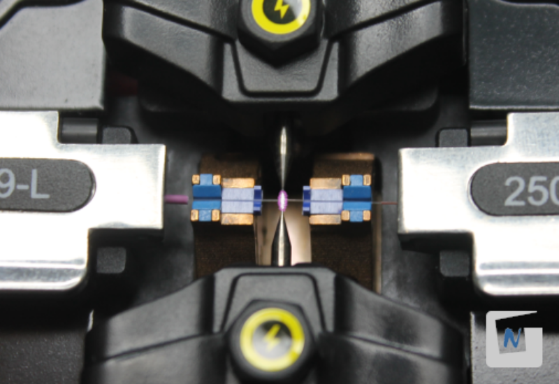

Este proceso se realiza mediante un equipo de fusión de fibra o fusionadora que alinea los núcleos de las dos fibras enfrentadas con motores servocontrolados por una cámara que realimenta su posición. Una vez enfrentados los núcleos, se produce un arco eléctrico generado por dos electrodos, que funde las fibras consiguiéndose así la fusión.

## Materiales y Herramientas

* **Materiales**
    * **Cable de fibra de un hilo multimodo**
    * **Alcohol y toallitas** para limpiar la fibra desnuda antes del empalme
    * **Canutillo**, tubos o mangas de protección, o un sistema de revestimiento de fibra
* **Herramientas**
    * **Tijeras de aramida** y otras herramientas para introducir el cable y separar fibras individuales para empalmar
    * **Peladora de fibra** con diferentes tamaños de orificios para eliminar revestimientos de protección de fibra
    * **Cuchilla de corte** para terminar la fibra a la longitud adecuada con extremos de alta calidad
    * **Máquina de empalme por fusión** (fusionadora)

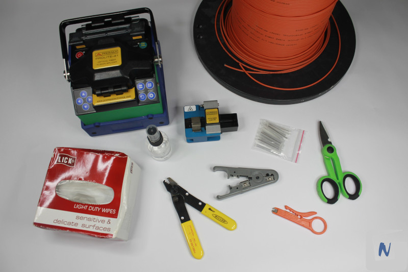

## Procedimiento

### 1. Retirar cubierta exterior

La fibra óptica está protegida mediante varias capas de plástico que hay que retirar previamente al fusionado.

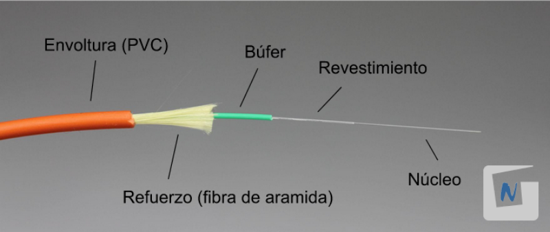

Para ello, se utiliza la peladora de fibra óptica, que dispone de **varios orificios con diferentes diámetros** para ir quitando las protecciones capa por capa, hasta llegar a la fibra. Por tanto, esta operación hay que repetirla para quitar sucesivamente cada una de las cubiertas del cable de fibra óptica.

Con una mano se toma la peladora de fibra, mientras con la otra se toma el extremo de una de las fibras ópticas y se introduce en el orificio adecuado de la peladora. Para retirar la cubierta exterior utilizaremos el diámetro mayor. A continuación **se hace un corte en la cubierta exterior de la peladora** y se retira dicha cubierta de plástico tirando con la mano. 

Es conveniente retirar entre 12-14 centímetros de cubierta exterior.

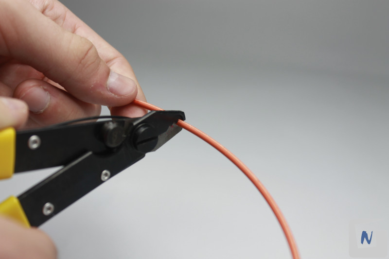
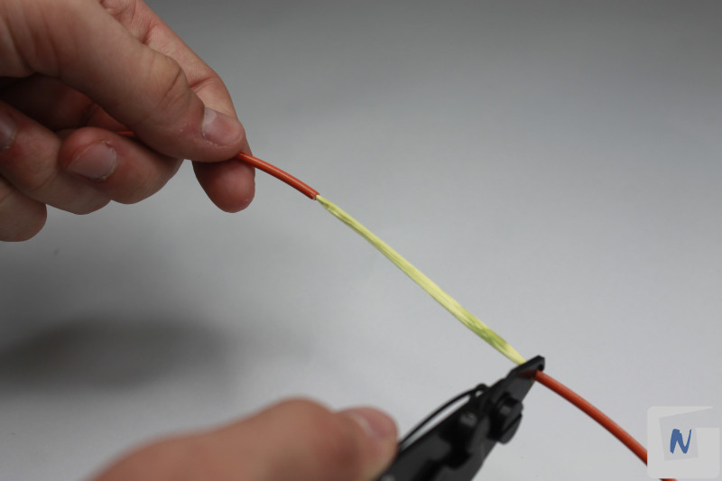

### 2. Retirar la aramida

Sujetar la fibra de aramida y cortarla haciendo uso de las tijeras de aramida.

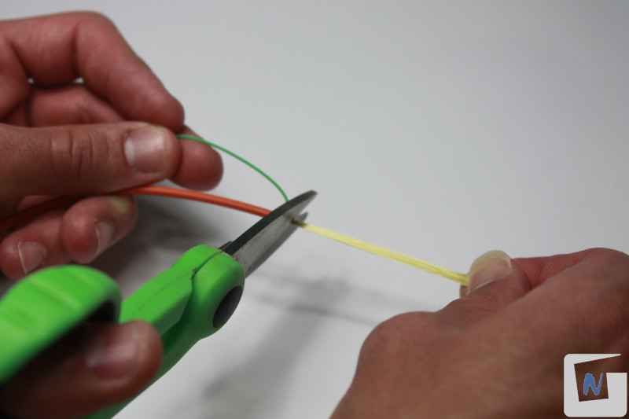

### 3. Insertar un canutillo protector

Antes de fusionar los dos cables de fibra óptica, hay que introducir en uno de ellos un **canutillo protector**. Después del fusionado, el canutillo **reforzará la fusión** impidiendo que los cables de fibra óptica se separen.

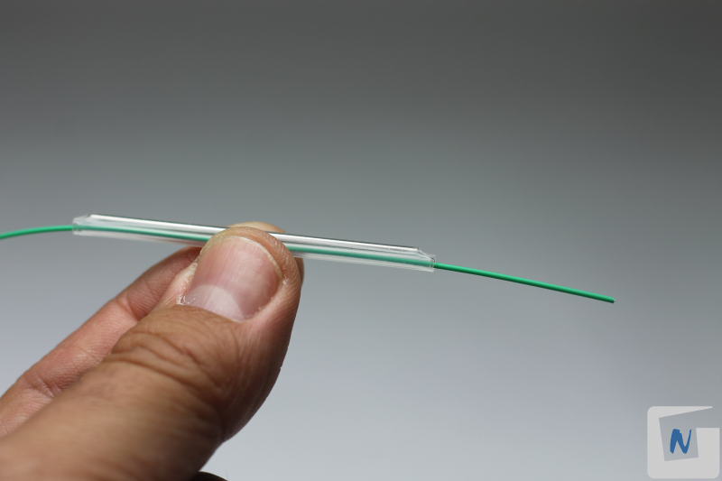

### 4. Quitar la protección plástica de la fibra

Mediante el uso de la peladora, utilizar el diámetro intermedio (900 micras) para retirar la primera cubierta, y el diámetro pequeño (125 micras) para retirar la última capa de protección. A continuación se **tira de la peladora** para retirar la cubierta de plástico de la fibra óptica. Unos 3 centímetros de fibra desnuda serán suficientes.

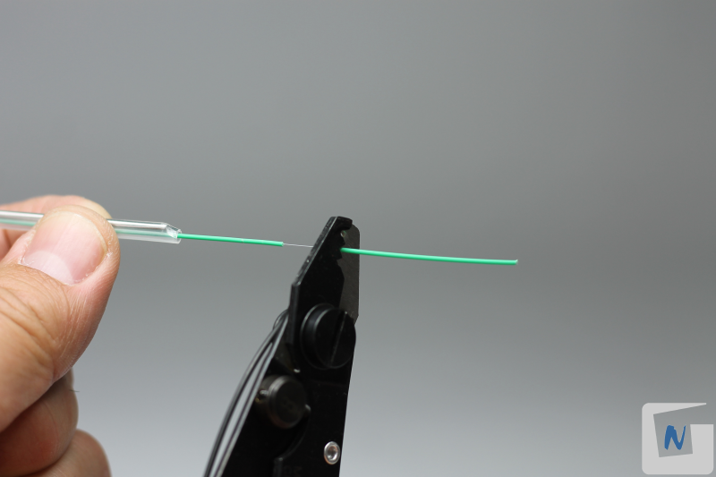

### 5. Limpiar la fibra con alcohol isopropílico

Cuando se retira la protección plástica quedan restos que hay que limpiar, para que la calidad de la fusión sea adecuada. Mediante una toallita impregnada con **alcohol isopropílico** se limpia la fibra suavemente.

La razón de utilizar este tipo de alcohol estriba en que se evapora muy rápidamente y no deja residuos.

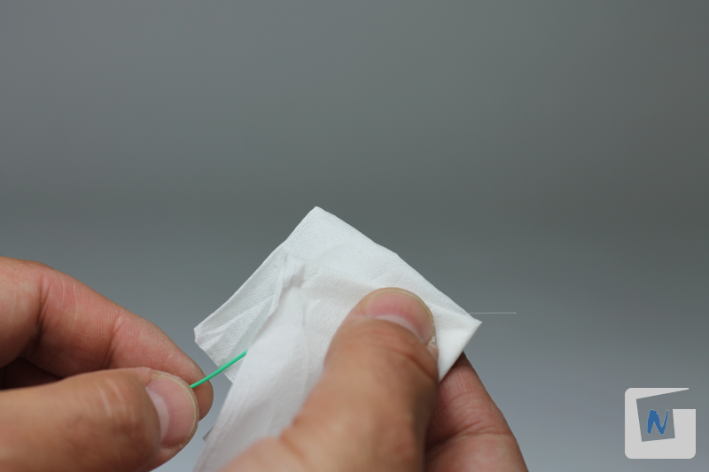

### 6. Cortar las fibras ópticas

Para realizar el corte de fibras se utiliza una **cortadora de precisión** que hace un corte a 90º de manera exacta. Sería imposible realizar un corte tan preciso con otras herramientas como por ejemplo unas tijeras. 

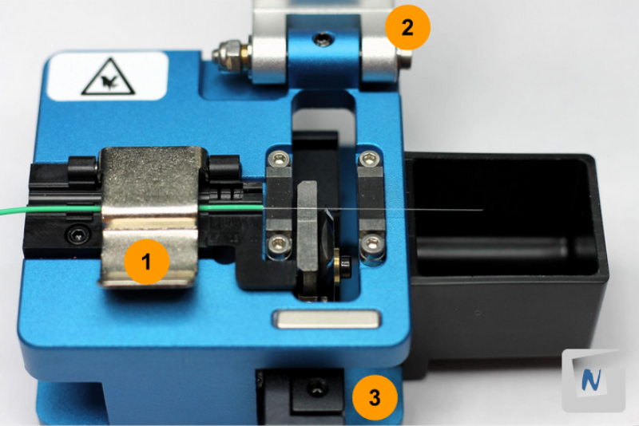

Para realizar el corte, se coloca una de las fibras en la guía de tal manera que al realizar el corte, queden de 12 a 17 mm de fibra desnuda (**1**). Esta medida viene definida por las especificaciones de la fusionadora que se vaya a utilizar.

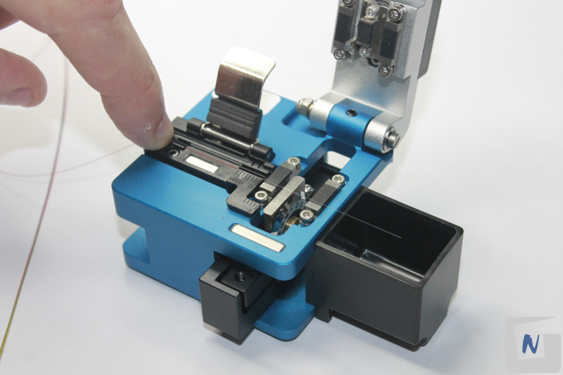

A continuación se baja la tapa (**2**) y se hace correr la cuchilla para cortar la fibra (**3**). Finalmente se repite la operación con la otra fibra.

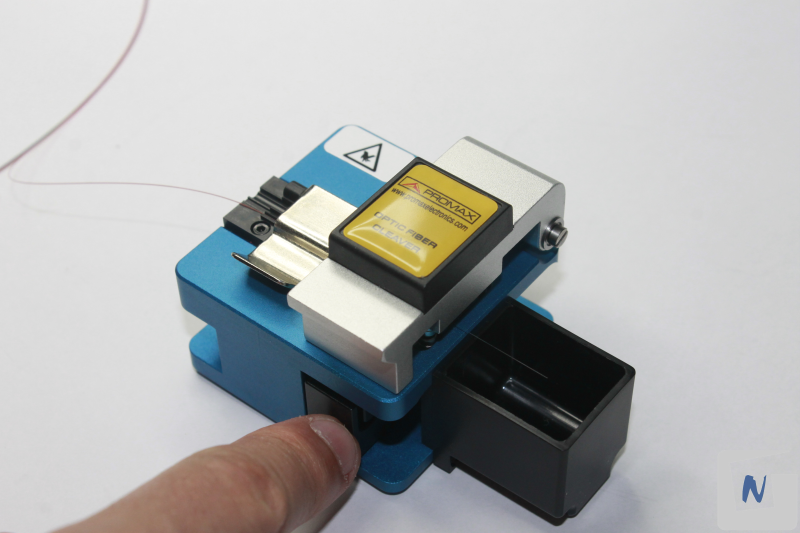

### 7. Fusionar los extremos de la fibra con la fusionadora
Para realizar la fusión se colocan y aseguran los extremos de ambas fibras en las guías dispuestas a tal efecto en la fusionadora. Los extremos de las fibras deben:

* Quedar alineados entre si.
* Quedar centrados respecto a los electrodos.

Siempre **sin que fibras ni electrodos hagan contacto físico**. 

La fusionadora de manera automática evalúa y alinea las fibras antes de proceder a derretir las puntas con una descarga eléctrica para que queden **fusionadas entre sí** y por tanto físicamente unidas.

Se configura la fusionadora indicándole el tipo de fibra (MM - Multimodo). En cuanto al “Modo operando Fusión”, se puede optar por tres opciones:

* **Automática**: la fusionadora se encarga de alinear las fibras e iniciar el fusionado de forma automática.
* **Semiautomática**: la fusionadora se encarga de alinear las fibras. El empalme/fusión se activa pulsando la tecla Inicio/Start.
* **Manual**: la alineación de las fibras de debe realizar manualmente haciendo uso de los “botones de dirección” de la fusionadora. El empalme/fusión se activa pulsando la tecla Inicio/Start.

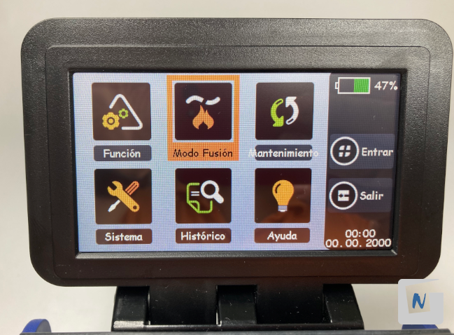

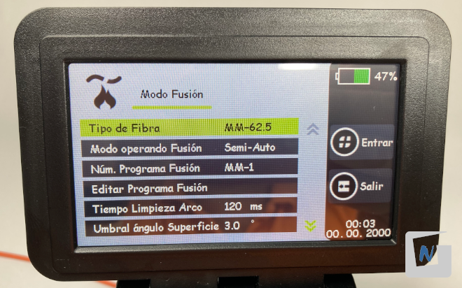

Se deben colocar los “soportes de fibra” del tamaño que se corresponde con cada cable. En este caso, se hace uso de los soportes o “holders” de 900 micras (0.9) en ambos lados.

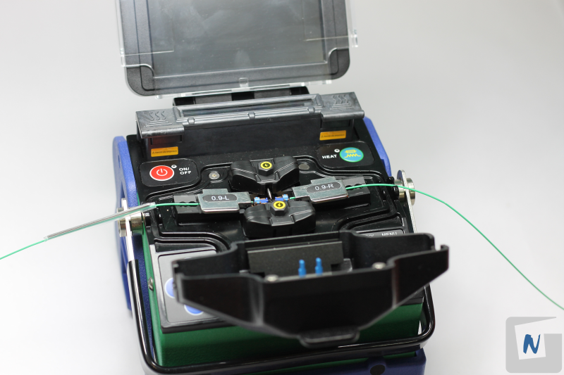

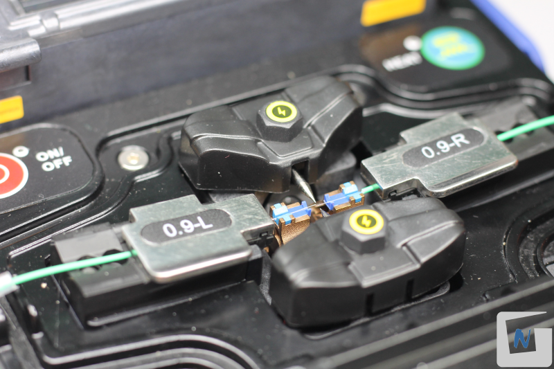

A continuación, se baja la tapa de la fusionadora y se pulsa el botón de fusión. 

Si la fusionadora interrumpe el proceso, puede ser debido a uno de estos problemas y habrá que revisar su correcta ejecución en los pasos anteriores:

* Los cables están mal dispuestos en sus guías.
* Las fibras no están cortadas a 90º.
* Han quedado restos de la cubierta plástica en la punta de la fibra.

Si por el contrario, la fusión ha sido correcta, el propio dispositivo estimará las pérdida de señal que producirá la fusión. 

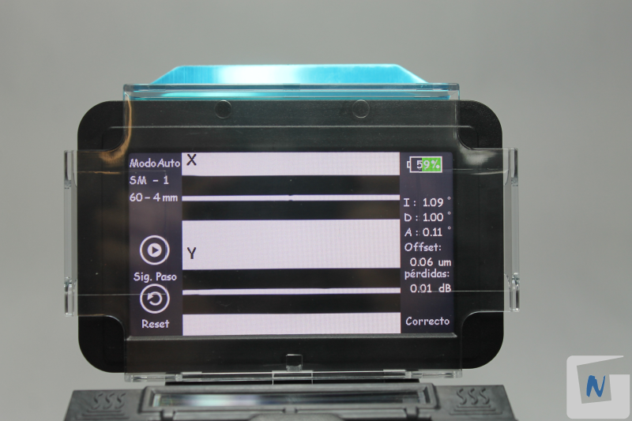

### 8. Cubrir la unión de la fibra con el canutillo

Después de la fusión de los extremos de las fibras, ambas fibras ópticas se convierten en una sola. Se extrae la fibra de las guías de la fusionadora y se cubre el punto de fusión con el canutillo protector que se introdujo en el primer paso. Ahora, se introduce el conjunto dentro del **horno de fusión** que incorpora la fusionadora y se pulsa el botón correspondiente para que el horno aplique calor y el plástico termoretráctil del canutillo se contraiga hasta que quede fijado sobre el punto de fusión y la fibra quede protegida.

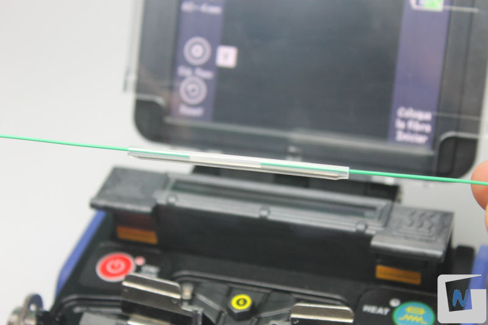

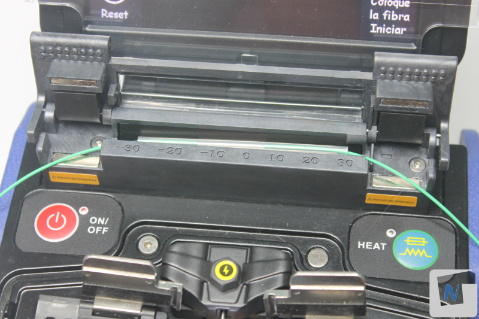

Una vez finalice el proceso, se debe sacar la fibra con su canutillo del horno, y esperar unos segundos a que se enfríe. Para ello, se puede situar sobre la “bandeja de refrigeración” que incorpora la propia fusionadora.

### 9. Probar el empalme

Una vez finalizado el proceso de fusión de la fibra, habría que comprobar que el empalme funciona correctamente y no se producen pérdidas significativas.

[P05: Prueba de enlace en fibra óptica](../P05/README.md)

