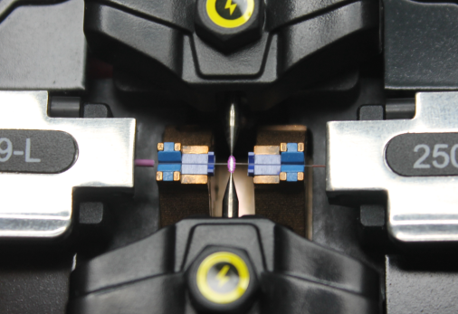
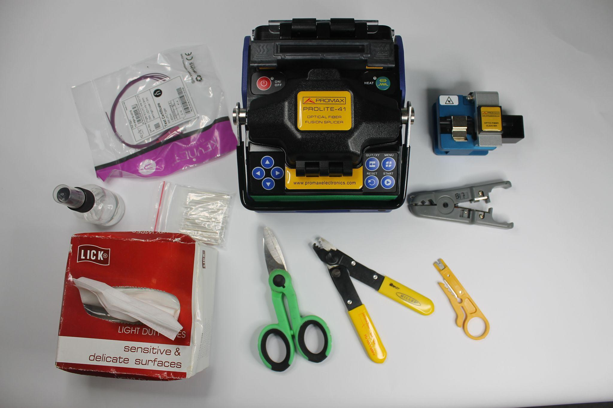

# P02. Empalme por fusión de dos fibras

## Objetivo
Realizar un empalme de dos hilos de fibra multimodo por fusión mediante fusionadora, previa preparación de los hilos de fibra.

## Introducción

En proyectos de instalación de fibra hay varias situaciones en las que es necesario empalmar una fibra con otra.  Debido a la poca pérdida de señal que produce, a su versatilidad y a su sencillez, el empalme por fusión es el más recomendable y utilizado.  Se usa para unir cables de fibra 4 casos principalmente:

* Unión de cables en tramos largos de planta exterior.
* Montaje de conectores de empalme prepulidos terminales (pigtails) en bandejas repartidoras.
* División de cables multifibras en distintos cables. Por ejemplo dividir un cable de 48 fibras en 8 cables de 6 fibras que van a distintos lugares.
* Reparación de cables donde se ha producido un corte de fibras. Por ejemplo es común que retroexcavadoras rompan una canalización de fibra y haya que realizar un empalme.

En general, cualquier situación en la que se han de unir dos fibras minimizando la pérdida de señal. 

La fusión de la fibra tiene carácter permanente y es necesaria para asegurar una transmisión de señal óptima en una red de fibra óptica.

La fusión de fibra óptica ofrece una unión más fuerte y estable que otros métodos de empalme, como los conectores mecánicos, que pueden tener pérdidas de señal debido a la reflexión de la luz en los extremos de la fibra. Además, la fusión de fibra óptica tiene una pérdida de señal mínima y se utiliza comúnmente en aplicaciones de larga distancia.

Utiliza calor a alta temperatura generado por un arco eléctrico para fusionar las dos fibras de vidrio, extremo a extremo, con el núcleo de fibra alineado con precisión. Las puntas de las dos fibras se juntan y se calientan para que se derritan. 

Este proceso se realiza mediante un equipo de fusión de fibra o fusionadora que alinea los núcleos de las dos fibras enfrentadas con motores servocontrolados por una cámara que realimenta su posición. Una vez enfrentados los núcleos, se produce un arco eléctrico generado por dos electrodos, que funde las fibras consiguiéndose así la fusión.

## Materiales y Herramientas

* **Materiales**
    * **Cable de fibra de un hilo multimodo**
    * **Alcohol y toallitas** para limpiar la fibra desnuda antes del empalme
    * **Canutillo**, tubos o mangas de protección, o un sistema de revestimiento de fibra
* **Herramientas**
    * **Tijeras de aramida** y otras herramientas para introducir el cable y separar fibras individuales para empalmar
    * **Peladora de fibra** con diferentes tamaños de orificios para eliminar revestimientos de protección de fibra
    * **Cuchilla de corte** para terminar la fibra a la longitud adecuada con extremos de alta calidad
    * **Máquina de empalme por fusión** (fusionadora)

