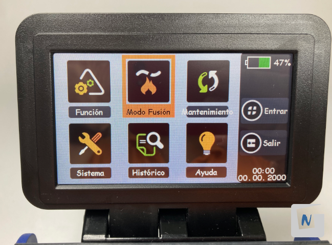
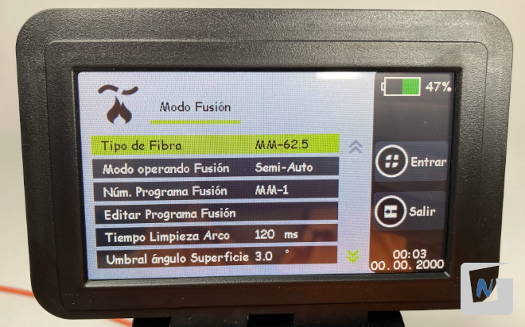

# P03. Fusionado de pigtail

## Objetivo

Preparar hilo de fibra de pigtail y un hilo de fibra de un cable holgado monotubo de 8 hilos de fibra óptica multimodo. Fusionar ambos hilos de fibra mediante fusionadora.

### Introducción

En el ámbito de las redes de fibra óptica, el término "pigtails" se refiere a un cable corto y pre-conectado con un conector en un extremo y con los hilos de la fibra óptica expuestos en el otro extremo. Aquí presentamos algunos de los tipos de pigtails de fibra óptica más comunes:

1. **Pigtails de fibra óptica monomodo**: estos pigtails se utilizan en aplicaciones de larga distancia y alta velocidad, y tienen una única vía de transmisión de la señal de luz.
2. **Pigtails de fibra óptica multimodo**: estos pigtails se utilizan en aplicaciones de corta distancia y baja velocidad, y tienen múltiples vías de transmisión de la señal de luz.
3. **Pigtails de fibra óptica de 12 fibras**: son pigtails que tienen 12 hilos de fibra óptica expuestos en el extremo.
4. **Pigtails de fibra óptica de 24 fibras**: son pigtails que tienen 24 hilos de fibra óptica expuestos en el extremo.
5. **Pigtails de fibra óptica con conectores SC, LC, ST, FC**: son pigtails que tienen diferentes tipos de conectores en el extremo pre-conectado.

## Materiales y Herramientas

* **Materiales**
    * **Cable holgado monotubo de 8 hilos de fibra multimodo**
    * **Pigtail de fibra óptica SC**
    * **Pelacables** con cuchilla para cortar revestimientos del cableado.
    * **Alicate** universal o de electricista.
    * **Peladora de fibra** con diferentes tamaños de orificios para eliminar revestimientos de protección de fibra
    * **Cuchilla de corte** para terminar la fibra a la longitud adecuada con extremos de alta calidad
    * **Máquina de empalme por fusión** (fusionadora)

## Procedimiento

Primero, se procede a preparar un hilo de fibra que se encuentra en el interior del cable/manguera de fibra multihilo.

### 1. Retirar cubierta exterior

El cable holgado monotubo o “manguera” contiene varías capas que hay que retirar previamente al fusionado.

Para retirar la cubierta exterior se realiza con el pelacables un corte en el extremo. Se coloca el cable en el pelacables y se rota este alrededor del cable.

Se dobla ligeramente el cable y se retira el trozo sobrante tirando con la mano.

Realizamos el mismo procedimiento para retirar unos 15-20 centímetros de la cubierta exterior.

Con unos alicates agarrar el hilo de rasgado firmemente y colocando el cable en vertical, tirar hacia abajo con fuerza.

Con el uso de las manos, abrir la cubierta y retirarla por completo.

### 2. Retirar la aramida

Sujetar la fibra de aramida y cortarla haciendo uso de las tijeras de aramida.

### 3. Quitar la protección plástica (tubo holgado)

Para retirar la tubo holgado de plástico que contiene las fibras en su interior, se debe encajar en el pelacables, en el hueco adecuado según su diámetro. Rotar el pelacables para realizar el corte. Finalmente,doblar ligeramente el tubo y tirar de él con las manos.

### 4.Limpiar el gel que recubre las fibras y separarlas

Utilizando papel para limpieza, limpiar el gel que recubre las fibras y separarlas manualmente.

### 5. Quitar la protección plástica de la fibra

Mediante el uso de la peladora, utilizar el diámetro pequeño (125 micras) para retirar la última capa de protección. A continuación se **tira de la peladora** para retirar la cubierta de plástico de la fibra óptica. Unos 3 centímetros de fibra desnuda serán suficientes.

### 6. Limpiar la fibra con alcohol isopropílico

Cuando se retira la protección plástica quedan restos que hay que limpiar, para que la calidad de la fusión sea adecuada. Mediante una toallita impregnada con **alcohol isopropílico** se limpia la fibra suavemente.

La razón de utilizar este tipo de alcohol estriba en que se evapora muy rápidamente y no deja residuos.

A continuación, preparar el hilo de fibra del Pigtail, para proceder posteriormente al fusionado con el hilo de fibra de la manguera o cable holgado.

### 7. Insertar un canutillo protector

Antes de realizar la fusión, hay que introducir el **canutillo protector en el Pigtail**. Después del fusionado, el canutillo **reforzará la fusión** impidiendo que los cables de fibra óptica se separen.

### 8. Retirar la protección plástica de la fibra del Pigtail

Mediante el uso de la peladora, utilizar el diámetro intermedio (900 micras) para retirar la primera cubierta, y el diámetro pequeño (125 micras) para retirar la última capa de protección. A continuación se **tira de la peladora** para retirar la cubierta de plástico de la fibra óptica. Unos 3 centímetros de fibra desnuda serán suficientes.

### 9. Limpiar la fibra con alcohol isopropílico

Cuando se retira la protección plástica quedan restos que hay que limpiar, para que la calidad de la fusión sea adecuada. Mediante una toallita impregnada con **alcohol isopropílico** se limpia la fibra suavemente.

La razón de utilizar este tipo de alcohol estriba en que se evapora muy rápidamente y no deja residuos.

### 10. Cortar la fibra óptica

Para realizar el corte de fibras se utiliza una **cortadora de precisión** que hace un corte a 90º de manera exacta. Sería imposible realizar un corte tan preciso con otras herramientas como por ejemplo unas tijeras. 

Para realizar el corte, se coloca una de las fibras en la guía de tal manera que al realizar el corte, queden de 12 a 17 mm de fibra desnuda (1). Esta medida viene definida por las especificaciones de la fusionadora que se vaya a utilizar.

Se debe observar que la cortadora tiene ranuras de diferentes tamaños donde colocar los hilos. La protección plástica del Pigtail preparado para su corte, es de mayor grosor que la del hilo sacado del tubo holgado. Se situará en cada caso en la ranura que corresponda.

### 11. Fusionar los extremos de la fibra con la fusionadora

Para realizar la fusión se colocan y aseguran los extremos de ambas fibras en las guías dispuestas a tal efecto en la fusionadora. Los extremos de las fibras deben:

* Quedar alineados entre si.
* Quedar centrados respecto a los electrodos.

Siempre **sin que las fibras ni electrodos hagan contacto físico**.

La fusionadora de manera automática evalúa y alinea las fibras antes de proceder a derretir las puntas con una descarga eléctrica para que queden fusionadas entre sí y por tanto físicamente unidas.

Se configura la fusionadora indicándole el tipo de fibra (MM - Multimodo). En cuanto al “Modo operando Fusión”, se puede optar por tres opciones:

* **Automática**: la fusionadora se encarga de alinear las fibras e iniciar el fusionado de forma automática.
* **Semiautomática**: la fusionadora se encarga de alinear las fibras. El empalme/fusión se activa pulsando la tecla Inicio/Start.
* **Manual**: la alineación de las fibras de debe realizar manualmente haciendo uso de los “botones de dirección” de la fusionadora. El empalme/fusión se activa pulsando la tecla Inicio/Start.

Se deben colocar los “soportes de fibra” del tamaño que se corresponde con cada cable. En este caso, se hace uso del soporte o “holder” de 900 micras (0.9) para el Pigtail y el soporte de 250 micras para el otro hilo.

A continuación, se baja la tapa de la fusionadora y se pulsa el botón de fusión. 

Si la fusionadora interrumpe el proceso, puede ser debido a uno de estos problemas y habrá que revisar su correcta ejecución en los pasos anteriores:

* Los cables están mal dispuestos en sus guías.
* Las fibras no están cortadas a 90º.
* Han quedado restos de la cubierta plástica en la punta de la fibra.

Si por el contrario, la fusión ha sido correcta, el propio dispositivo estimará las pérdida de señal que producirá la fusión. 

### 12. Cubrir la unión de la fibra con el canutillo

Después de la fusión de los extremos de las fibras, ambas fibras ópticas se convierten en una sola. Se extrae la fibra de las guías de la fusionadora y se cubre el punto de fusión con el canutillo protector que se introdujo anteriormente. Ahora, se introduce el conjunto dentro del **horno de fusión** que incorpora la fusionadora y se pulsa el botón correspondiente para que el horno aplique calor y el plástico termoretráctil del canutillo se contraiga hasta que quede fijado sobre el punto de fusión y la fibra quede protegida.

Una vez finalice el proceso, se debe sacar la fibra con su canutillo del horno, y esperar unos segundos a que se enfríe. Para ello, se puede situar sobre la “bandeja de refrigeración” que incorpora la propia fusionadora.

### 13. Probar el empalme

Una vez finalizado el proceso de fusión de la fibra, habría que comprobar que el empalme funciona correctamente y no se producen pérdidas significativas.

[P05: Prueba de enlace en fibra óptica](../P05/README.md)
