# P04. Terminación cable fibra óptica en bandeja de 19"

## Objetivo

Instalar dos cajas de distribución o bandejas en los extremos de un cable de 8 holgado monotubo de 8 fibras ópticas multimodo realizando fusionado de las fibras de dicho cable con Pigtails para su terminación en la bandeja. Estas cajas de distribución se instalarán en sus correspondientes armarios de comunicaciones rack.

## Introducción

En la práctica actual, las diferentes fibras del cable se fusionaran con pigtail, que vienen ya montados en fábrica, ofreciendo total garantía del acabado de los conectores. 

Hoy día no es común que nosotros tengamos que realizar las tareas de conectorización (montaje de conector en fibra óptica) y pulido de las fibras. Es obvio que un pigtail construido en fábrica va a producir mucha menos atenuación dado que el pulido es más eficiente.

Cuando se usan pigtails comerciales y se compran por grupos, éstos vienen con el recubrimiento primario en un color que fija el orden de instalación en la bandeja, para su correspondiente identificación.

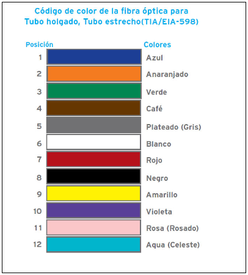

## Materiales y Herramientas

* **Materiales**
    * **Bandeja** de fibra óptica de 19”
    * **Acopladores** para bandeja de fibra
    * **Cable holgado monotubo de 8 hilos de fibra multimodo**
    * **Pigtail** o rabillos prefabricados SC
    * **Bridas de plástico**
    * **Alcohol y toallitas** para limpiar la fibra desnuda antes del empalme
    * **Canutillo**, tubos o mangas de protección, o un sistema de revestimiento de fibra

* **Herramientas**
    * **Tijeras de aramida** y otras herramientas para introducir el cable y separar fibras individuales para empalmar
    * **Pelacables** con cuchilla para cortar revestimientos del cableado.
    * **Peladora de fibra** con diferentes tamaños de orificios para eliminar revestimientos de protección de fibra
    * **Cuchilla de corte** para terminar la fibra a la longitud adecuada con extremos de alta calidad
    * **Máquina de empalme por fusión** (fusionadora)
    * **Destornillador** para fijar la bandeja al armario

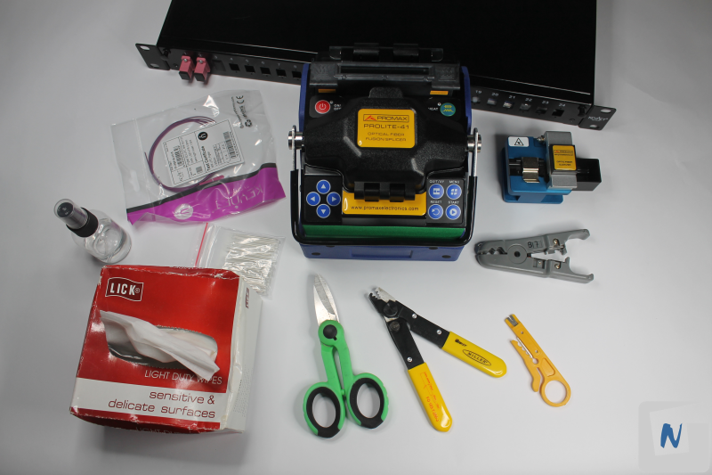

## Procedimiento

### 1. Preparar la bandeja

Primero, se abre la bandeja tirando hacia afuera de los dos “tornillos” situados en el frontal.

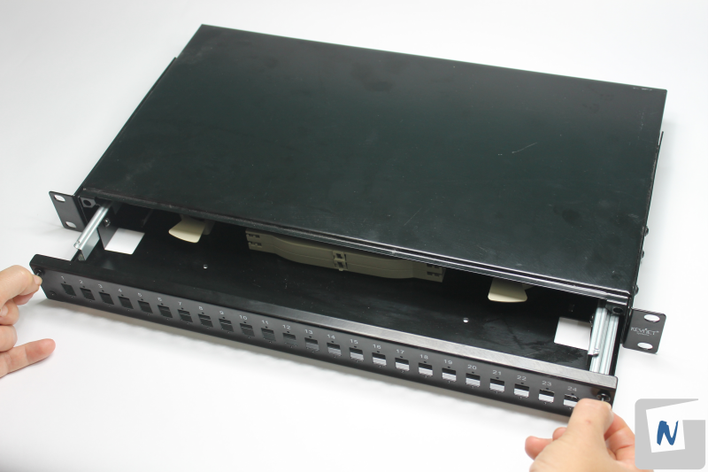

Principales partes de la bandeja:

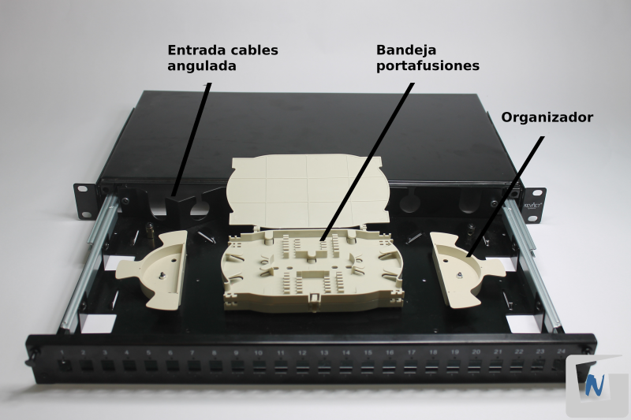

Se coloca el pasamuros o prensaestopa de plástico en una de las entradas posteriores anguladas, enroscándola hasta que quede firme. 

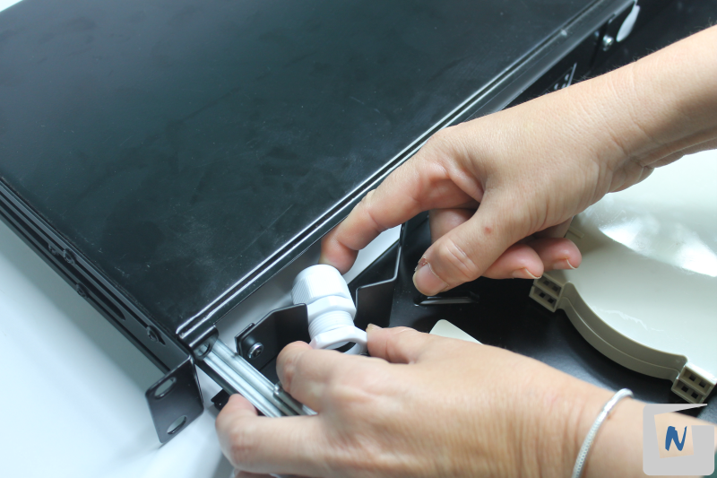

### 2. Introducir y preparar hilo de fibra de cable “multihilo”

Introducir el cable sin pelar en la bandeja por el pasamuros trasero, aflojando previamente la tuerca de apriete. Si la tuerca no consiguiera apretar fuertemente la entrada del cable, utiliza cinta aislante para aumentar el grosor del cable. Aprieta la tuerca finalmente.

En un caso real, se pelará aproximadamente 1 metro de cable, en previsión de posibles roturas, modificaciones, etc.
.
Se preparan los hilos de fibra tal como se muestra en la práctica [P03: Fusionado de pigtail](../P03/README.md).

### 3. Fijar cable en la bandeja

Se fija el cable con dos bridas en la entrada interior a la bandeja a para que no pueda retroceder, en caso de tirar de él desde el otro extremo.

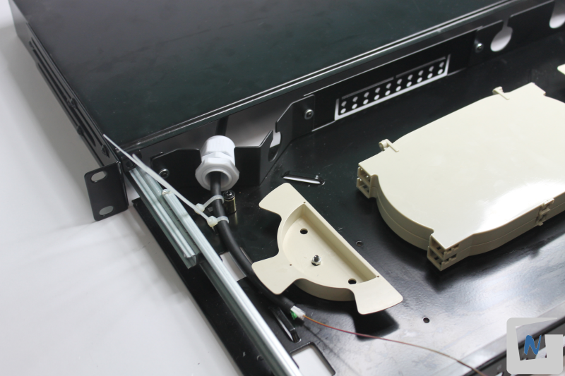

### 4. Preparar hilo de fibra del Pigtail

Se prepara el hilo de fibra de un Pigtal según la práctica [P03: Fusionado de pigtail](../P03/README.md).

### 5. Cortar, fusionar y proteger la unión de las dos fibras

Una vez preparados el hilo de fibra del cable holgado y por otro lado la fibra del Pigtail, se procede a la fusión y protección de dicha unión siguiente los pasos de práctica [P03: Fusionado de pigtail](../P03/README.md).

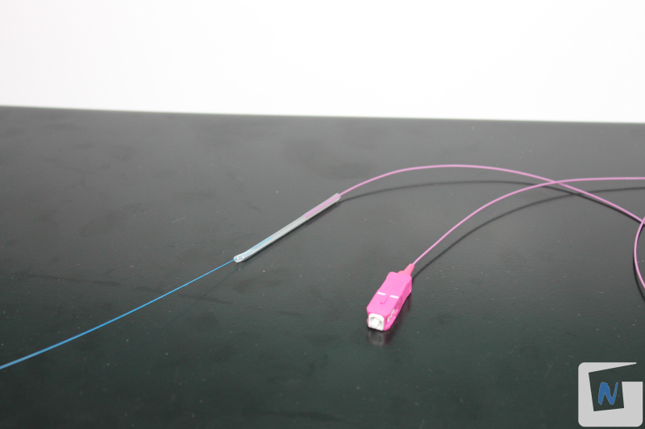

### 6. Introducir adaptadores SC en frontal de la bandeja

Introducir los adaptadores/acopladores SC en los alojamientos del frontal de la caja. No retirar el guardapolvo del acoplador hasta que sea necesario.

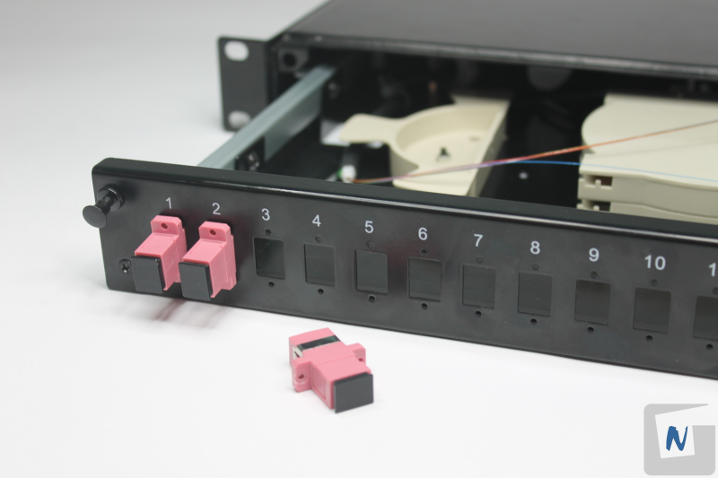

Cubrir los huecos vacíos de la bandeja con guardapolvos.

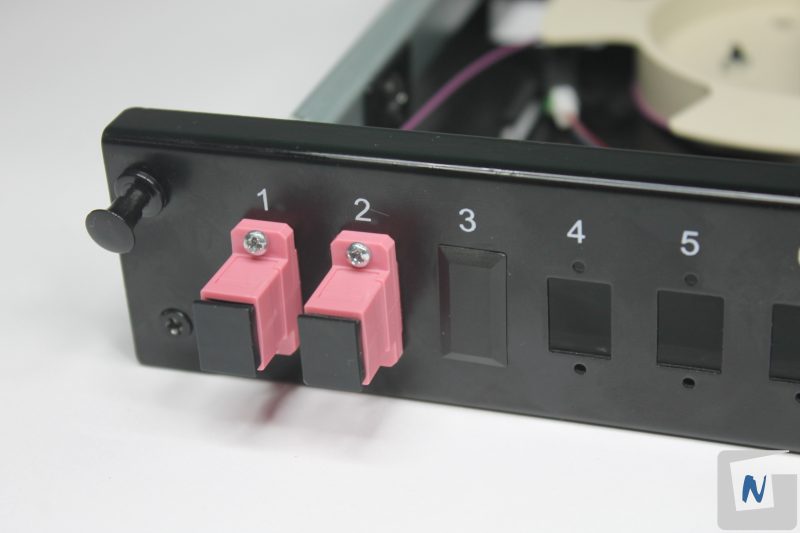

### 7. Ordenar bandeja

Quitar el tapón protector del Pigtail y conectarlo a uno de los acopladores por la parte interna de la bandeja.

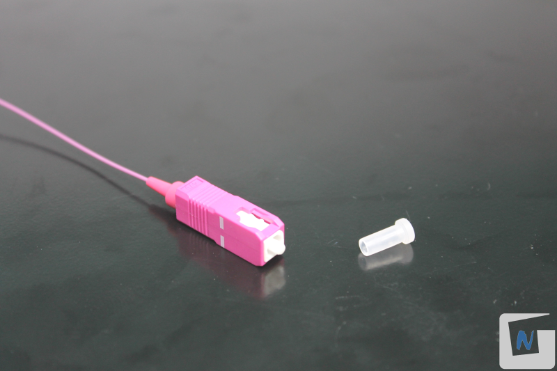

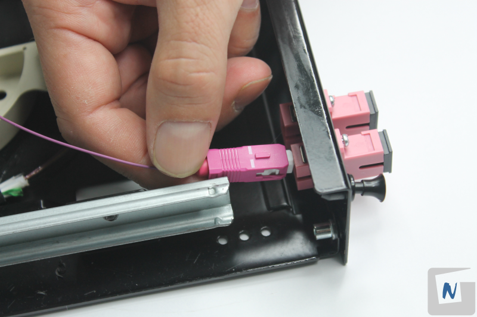

Colocar y ordenar en la bandeja portafibra. Insertar el canutillo protector de la fusión en la bandeja “portafusiones” y ordenar los hilos de fibra procurando que no existan excesivas curvaturas y alojando los empalmes en las ranuras correspondientes.

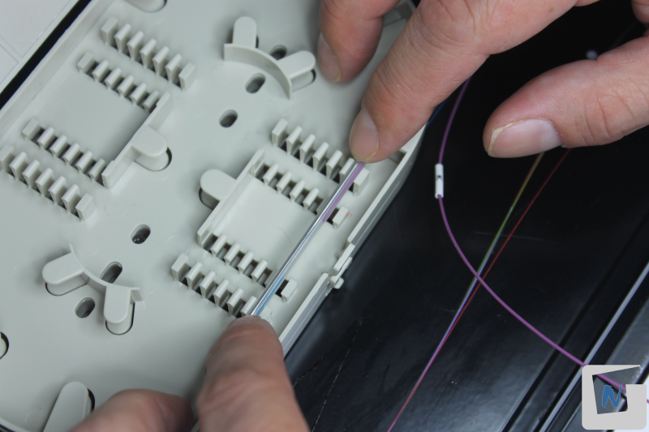

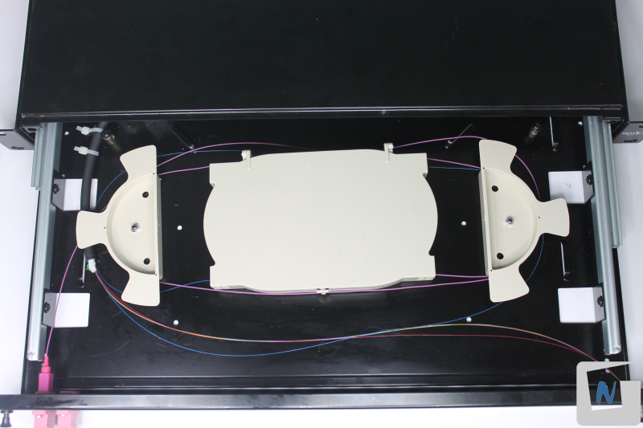

Repetir los pasos anteriores con los diferentes hilos de fibra que necesites. Ordenar los hilos de forma adecuada.

### 8. Colocar bandeja en armario rack

Empujar los dos “tornillos” exteriores para cerrar correctamente la bandeja.

Fijar la bandeja en el armario rack. Para ello se utilizan los tornillos que incluye la propia bandeja.

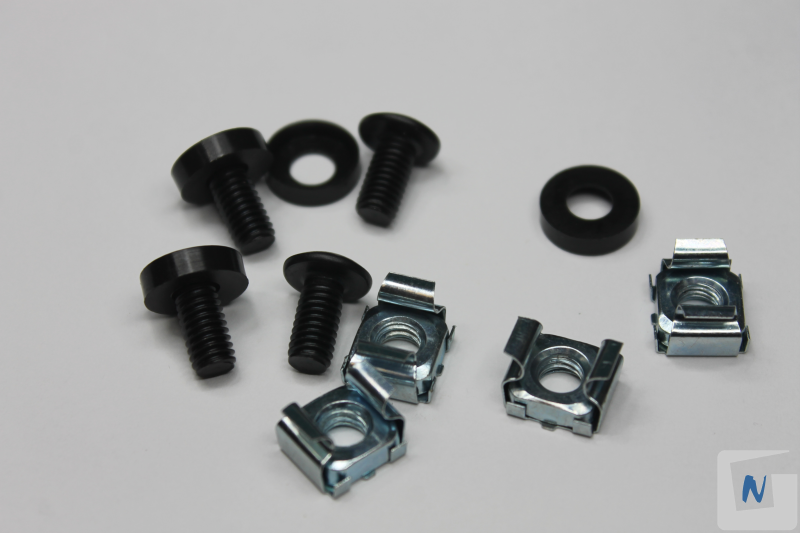

Se colocan las tuercas “enjauladas” en el armario, a la altura que se quiere situar la bandeja.

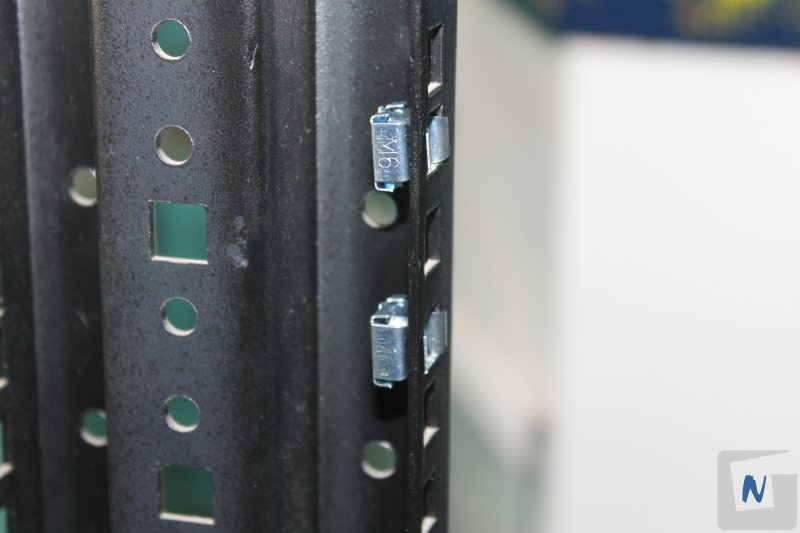

Se sitúa la bandeja y se atornilla.

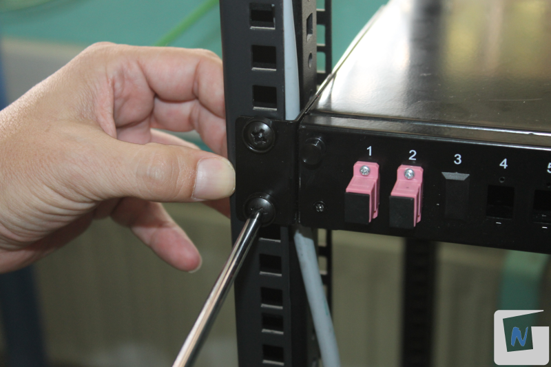

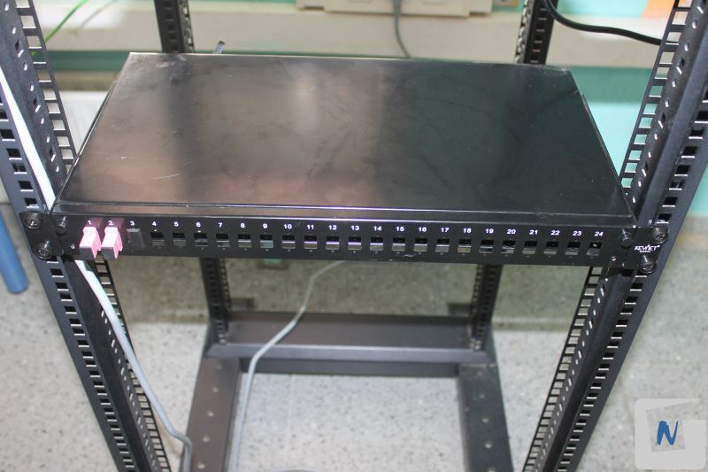

### 9.Interconectar con otra bandeja

Repetir los pasos anteriores con otra bandeja de fibra, utilizando el otro extremo del cable holgado.

### 10. Probar el empalme

Una vez finalizado el proceso de fusión de la fibra, habría que comprobar que el empalme funciona correctamente y no se producen pérdidas significativas.

[P05: Prueba de enlace en fibra óptica](../P05/README.md)
