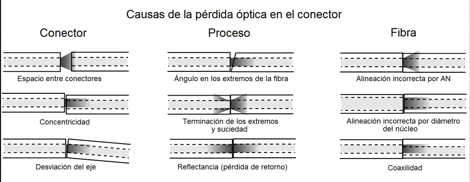
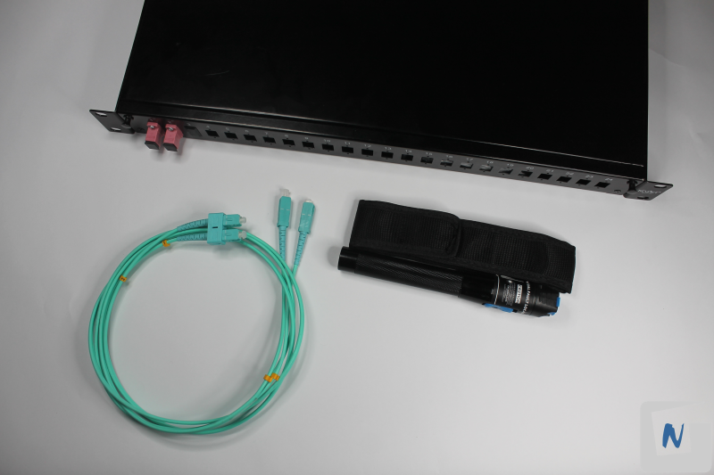
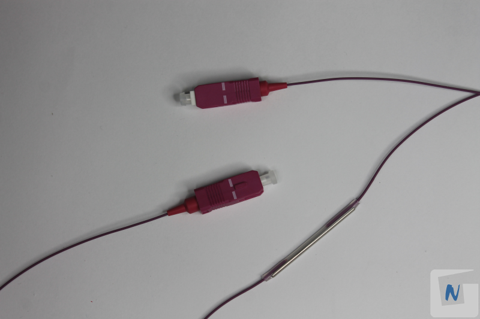
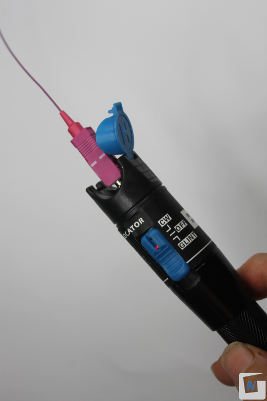
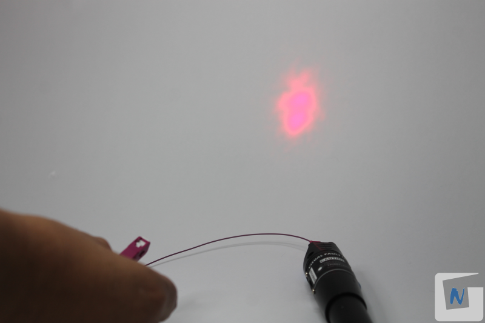
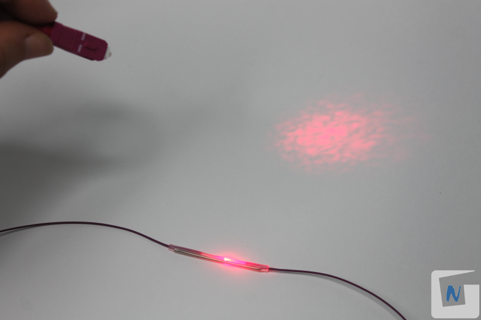
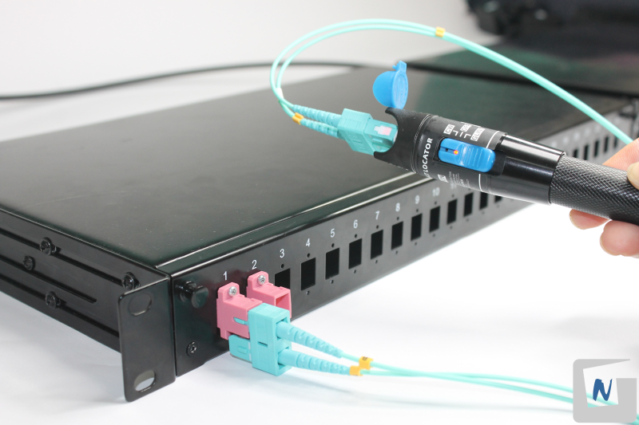
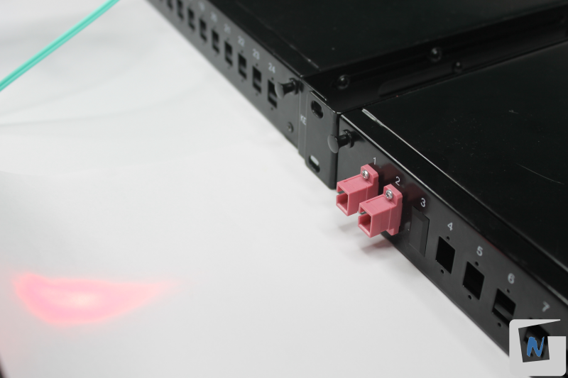

# P05. Prueba de enlace en fibra óptica

## Objetivo

Comprobar la fusión de hilos de fibra óptica mediante un Localizador visual de fallos (linterna láser). 

## Introducción

La detección de fallos en fibra óptica es un proceso importante para garantizar la calidad de la transmisión de la señal de luz a través de la fibra óptica.

Existen varios tipos de fallos en la fibra óptica, y las técnicas utilizadas para detectar cada uno de ellos pueden variar. A continuación, se describen algunos de los tipos de fallos más comunes y las técnicas utilizadas para su detección:

1. **Pérdida por atenuación**: La pérdida por atenuación es la disminución de la intensidad de la señal de luz a medida que se transmite a través de la fibra óptica. Las pérdidas por atenuación pueden deberse a una variedad de factores, como la absorción, la dispersión, la curvatura de la fibra o la contaminación de los conectores. Las técnicas comunes para detectar pérdidas por atenuación incluyen:
    * **Inspección visual**: La inspección visual de la fibra óptica puede revelar signos de pérdida por atenuación, como una fibra doblada o rota.
2. **Pérdida por dispersión**: La pérdida por dispersión se produce cuando la señal de luz se separa en sus componentes de frecuencia y se desfasa a medida que se transmite a través de la fibra óptica. Las pérdidas por dispersión pueden ser causadas por la dispersión cromática (debido a la variación en la velocidad de propagación de la luz según la longitud de onda) o la dispersión modal (debido a la variación en los modos de propagación de la luz en la fibra).
3. **Pérdida por empalme o conexión**: La pérdida por empalme o conexión se produce en los puntos de empalme o conexión de las fibras ópticas. Estos puntos pueden ser puntos de corte, conectores o empalmes mecánicos, y pueden causar pérdidas por reflexión o por atenuación. Las técnicas comunes para detectar pérdida por empalme o conexión incluyen:
    * **Inspección visual**: La inspección visual de los conectores y empalmes pueden revelar signos de daño o contaminación, lo que puede indicar la presencia de pérdida.

    

4. **Rotura o corte de la fibra**: La rotura o corte 	de la fibra se produce cuando la fibra óptica se rompe o corta debido a factores externos, como la tensión excesiva, la flexión 	excesiva o el impacto. Las técnicas comunes para detectar rotura o corte de la fibra incluyen:
	* **Inspección visual**: La inspección visual de la fibra puede revelar una rotura o corte visible.

Además de estas técnicas de detección, también es importante llevar a cabo un mantenimiento preventivo de la fibra óptica, como la limpieza regular de los conectores. Esto ayuda a prevenir fallos en la fibra óptica antes de que ocurran y garantiza una transmisión de señal óptima.

## Materiales y Herramientas

* **Materiales**
    * **Dos pigtails de fibra óptica SC**
    * **Latiguillo** de fibra óptica SC
    * **Dos bandejas de fibra interconectadas**
* **Herramientas**
    * **Localizador visual de fallos** (linterna láser)

## Procedimiento

Para comenzar esta práctica tomaremos como ejemplo un fusionado de dos Pigtail con conexión SC.

### 1. Conectar la luz láser a un extremo

Se conecta la linterna al extremo de un Pigtal SC.

### 2. Comprobar luz proyectada

Ahora, al proyectar el haz de luz desde el conector libre sobre un fondo blanco, en caso de que exista continuidad se puede comprobar que la cantidad proyección de luz es importante. Se debe tener cuidado de no mirar directamente a esa luz, y no proyectarla sobre los compañeros/as.

Para localizar fallos distintos a la continuidad, y si la cubierta exterior te lo permite, moverse a lo largo de la fibra desde cualquier extremo, buscando un brillo rojizo proveniente de la camisa de la fibra o el alojamiento de un conector.

En caso de una fusión defectuosa o rotura, se puede apreciar como la luz se “escapa” de la fibra, y que la proyección de luz láser no es tan clara y nítida como en un fusión correcta.

La siguiente prueba a realizar será utilizando dos bandejas previamente interconectadas con cable holgado monotubo de fibra óptica, tal como se ha realizado en la práctica [P04: Terminación cable fibra óptica en bandeja de 19"](../P04/README.md).

### 3. Conectar la linterna en acoplador SC de bandeja

Se utiliza un latiguillo de fibra óptica SC para conectar la “linterna láser” al acoplador SC de la bandeja de fibra.

### 4. Comprobación en el otro extremo de la bandeja

Se utiliza un papel blanco, el cual se coloca frente a la salida (acoplador) de la otra bandeja. Se comprueba la cantidad de luz proyectada sobre el mismo, la cual nos indica si la conexión es correcta.

