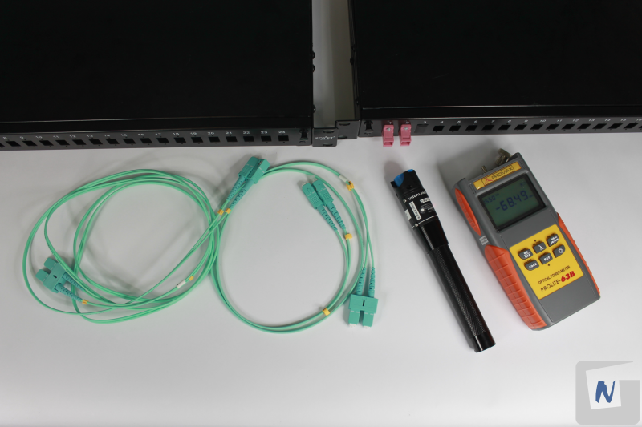
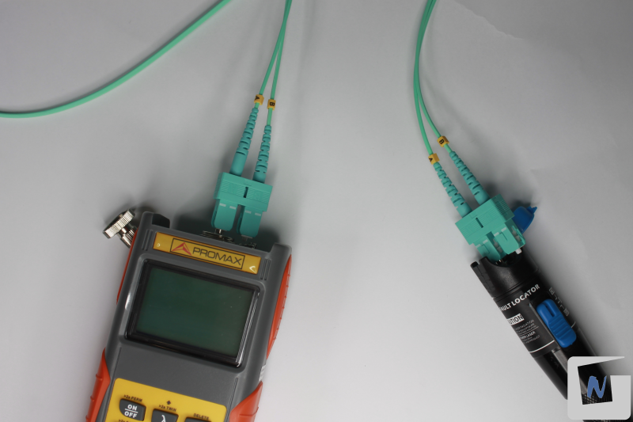
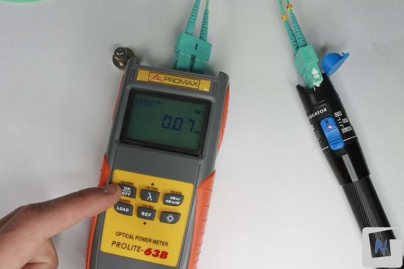
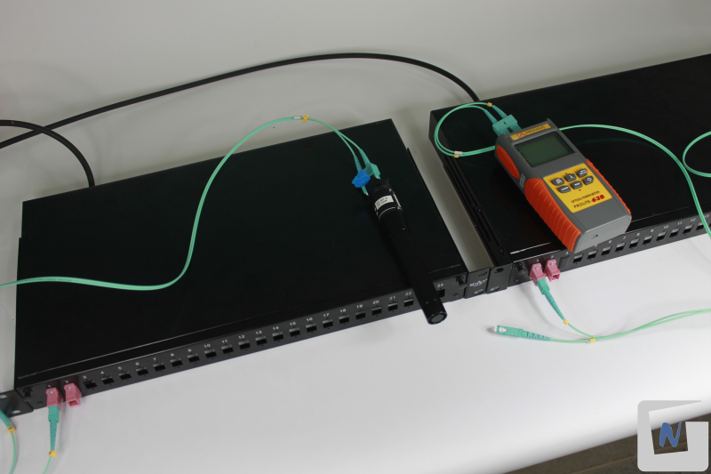
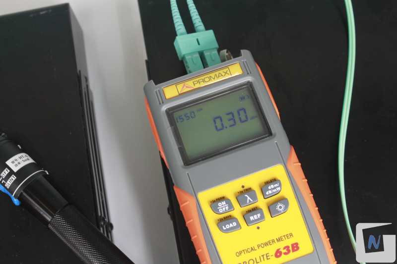

# P06. Medición de pérdidas en fibra óptica

## Objetivo

Comprobar la pérdida por atenuación de una fusión de fibra óptica en la interconexión de dos bandejas de fibra óptica.

## Introducción

Existen varios tipos de fallos en la fibra óptica, y las técnicas utilizadas para detectar cada uno de ellos pueden variar. A continuación, se describen algunos de los tipos de fallos más comunes y las técnicas utilizadas para su detección:

1. **Pérdida por atenuación**: La pérdida por atenuación es la disminución de la intensidad de la señal de luz a medida que se transmite a través de la fibra óptica. Las pérdidas por atenuación pueden deberse a una variedad de factores, como la absorción, la dispersión, la curvatura de la fibra o la contaminación de los conectores. Las técnicas comunes para detectar pérdidas por atenuación incluyen:
    * **Medición de potencia**: Se utiliza un medidor de potencia óptica para medir la intensidad de la señal de luz que se transmite a través de la fibra. Si la intensidad de la señal es menor de lo esperado, puede indicar una pérdida por atenuación.
2. **Pérdida por dispersión**: La pérdida por dispersión se produce cuando la señal de luz se separa en sus componentes de frecuencia y se desfasa a medida que se transmite a través de la fibra óptica. Las pérdidas por dispersión pueden ser causadas por la dispersión cromática (debido a la variación en la velocidad de propagación de la luz según la longitud de onda) o la dispersión modal (debido a la variación en los modos de propagación de la luz en la fibra). Las técnicas comunes para detectar pérdida por dispersión incluyen:
    * **Reflectometría óptica de dominio de tiempo (OTDR)**: Los OTDR emiten pulsos de luz a través de la fibra y miden el tiempo que tarda en reflejarse la señal de luz. Esto permite medir la longitud de onda y la amplitud de las reflexiones, lo que puede indicar la presencia de pérdida por dispersión.	
 	* **Medición de ancho de banda**: La medición de ancho de banda de la señal de luz transmitida a través de la fibra puede revelar la presencia de pérdida por dispersión.
3. **Pérdida por empalme o conexión**: La pérdida por empalme o conexión se produce en los puntos de empalme o conexión de las fibras ópticas. Estos puntos pueden ser puntos de corte, conectores o empalmes mecánicos, y pueden causar pérdidas por reflexión o por atenuación. Las técnicas comunes para detectar pérdida por empalme o conexión incluyen:
    * **Reflectometría óptica de dominio de tiempo (OTDR)**: Los OTDR pueden detectar la presencia de reflexiones en los puntos de empalme o conexión, lo que puede indicar la presencia de pérdida.
4. **Rotura o corte de la fibra**: La rotura o corte 	de la fibra se produce cuando la fibra óptica se rompe o corta debido a factores externos, como la tensión excesiva, la flexión 	excesiva o el impacto. Las técnicas comunes para detectar rotura o corte de la fibra incluyen:
    * **Reflectometría óptica de dominio de tiempo (OTDR)**: Los OTDR pueden localizar el punto de rotura o corte de la fibra midiendo la longitud de onda y 	la amplitud de las reflexiones.

La medición de pérdidas en un enlace de fibra óptica es crucial para garantizar un rendimiento óptimo en las comunicaciones de fibra óptica. En esta práctica, se explicará cómo medir las pérdidas de un enlace de fibra óptica utilizando un medidor de potencia óptica y una fuente de luz láser.

## Materiales y Herramientas

* **Materiales**
    * Dos **latiguillos** de fibra óptica con conectores SC
    * Dos **bandejas de fibra interconectadas**
* **Herramientas**
    * **Medidor de potencia** de fibra óptica
    * **Localizador visual de fallos** (linterna láser)

## Procedimiento

Partimos de dos bandejas de fibra interconectadas con cable holgado de 8 fibras, en las cuales hemos fusionado varias fibras con sus respectivos Pigtails, y conectado estos a los acopladores de la bandeja

### 1. Conectar la luz láser y medidor de potencia

Conectar a un latiguillo de fibra con conexiones SC, en un extremo el medidor de potencia y en el otro la “linterna láser”.

### 2. Comprobar valor inicial

Encender ambos apartados y comprobar el valor arrojado por el medidor de potencia.

El medidor de potencia muestra un valor de pérdidas por atenuación expresado en dB (Decibelios). Registrar el valor de potencia medida (a modo de tara o valor de referencia). 

En la imagen 0.07 dB.

### 3. Conectar entre bandejas 

Conectar en cada bandeja un latiguillo de fibra (conector SC), utilizando el mismo número de acoplador, donde se conectan las fibras fusionadas. [P04: Terminación cable fibra óptica en bandeja de 19"](../P04/README.md).

En el latiguillo de una bandeja se conecta el medidor de potencia.

En el latiguillo de la otra bandeja se conecta la “linterna laser”.

### 4. Comprobar pérdidas

Encender ambos aparatos y registrar el valor de potencia medida.

Al valor arrojado por el medidor de potencia, restar el valor de referencia obtenido en pasos anteriores. Menos de 10 db es un resultado aceptable.

Según la siguiente imagen, se resta a 30 dB el valor de referencia de 0.07 dB, obteniendo como resultado unas pérdidas muy bajas: 0.23 dB.

