# P07. Utilización del convertidor de medios

## Objetivo

Se pretende utilizar el convertidor de medios para enlazar dos equipos informáticos conectados a dos bandejas de fibra óptica interconectadas entre sí.

## Introducción

Un convertidor de medios de fibra puede realizar la conversión de señales ópticas y señales eléctricas. Se encarga de convertir señales eléctricas en señales ópticas, transmitirlas a través de fibras ópticas y convertir señales ópticas en señales eléctricas en el otro extremo.

Los convertidores de medios de fibra óptica se utilizan generalmente en entornos de red reales donde los cables Ethernet no son suficientes y se debe utiliza fibra óptica para ampliar la distancia de transmisión. De esta manera, se logrará conectar una estación de trabajo distante a una red local utilizando fibra óptica. Esta solución también resulta útil cuando la estación de trabajo, aunque no esté a distancia, se encuentra en un entorno con interferencia electromagnética.

## Materiales y Herramientas

* **Materiales**
    * Dos **bandejas de fibra interconectadas**
    * Dos **latiguillos SC-LC**
    * Dos **convertidores de medios**
    * Dos **transceptores de fibra óptica**
    * Dos latiguillos de red RJ45
    * Dos ordenadores con tarjeta de red para RJ45

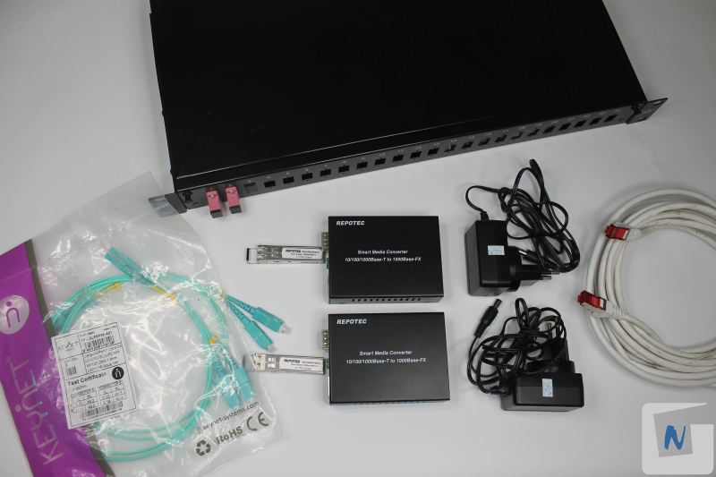

## Procedimiento

### 1. Colocar transceptor en el convertidor de medios

Se inserta el transceptor o transceiver (conexión LC) en el Convertidor de medios.

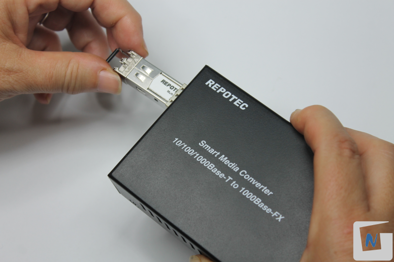

### 2. Preparar latiguillo fibra SC-LC

En el caso de que los conectores SC del latiguillo vengan unidos, hay que separarlos.

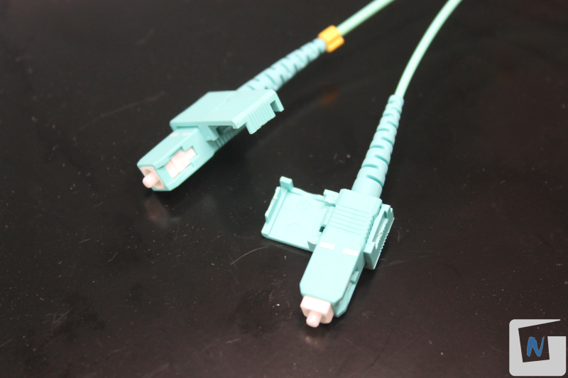

### 3. Conectar convertidor de medios

Es importante asegurarse de que el conversor esté conectado a la corriente para su funcionamiento. Se encenderá la luz “PWR”.

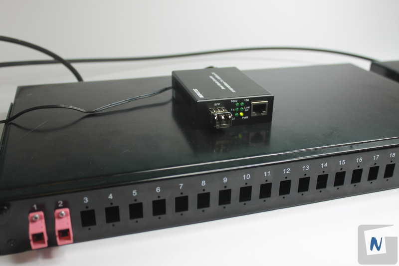

Conectar el convertidor de medios a la bandeja mediante el latiguillo de fibra óptica SC-LC.. Se utilzará el primer acoplador, el cuál interconecta las dos bandejas de fibra, tal como se realiza en la práctica P04: Terminación cable fibra óptica en bandeja de 19".

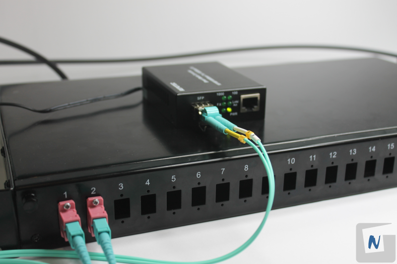

### 4. Conectar convertidor de medios a la otra bandeja

Conectar otro convertidor de medios a la segunda bandeja. Se observa que se enciende la luz “FX”.
 
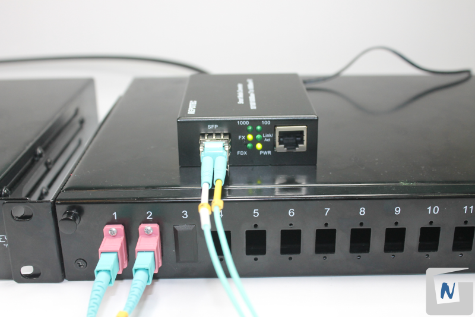

### 5. Conectar los ordenadores a los convertidores de medios

Se insertará el cable de red en el adaptador RJ45 del conversor de medios, utilizando un latiguillo directo de acuerdo con la norma TIA 568B. Luego, se conectará el otro extremo del cable al adaptador RJ45 de la otra computadora.

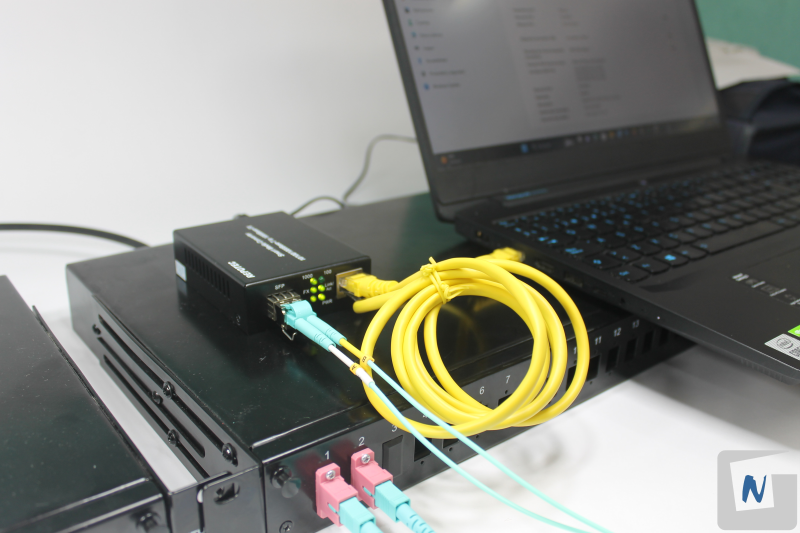

La luz Link/Act indica que el enlace de par trenzado está correctamente conectado. La luz intermitente indica que los datos se están transmitiendo en el par trenzado.

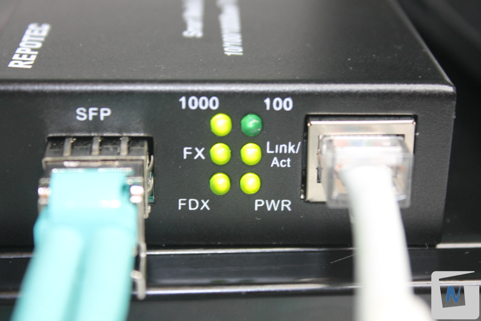

### 6. Configurar adaptador de red

Es necesario configurar el adaptador de red con los parámetros adecuados para una LAN, incluyendo una dirección IP y una máscara de subred. En este caso, se utilizará la dirección IP **192.168.1.1**.

En el adaptador de red de la otra computadora se utilizará la dirección IP 192.168.1.2.

Ejemplo realizado en Sistema Operativo Windows:

**Anterior a Windows 11**

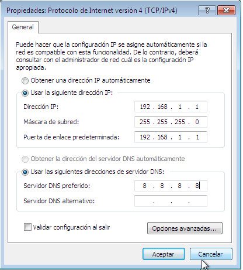

**Windows 11**

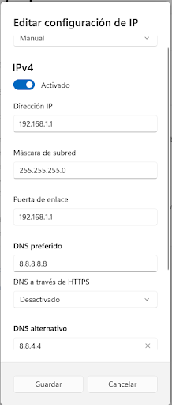

### 7.Comprobar conectividad

Se procederá a realizar una prueba de conexión mediante el comando **ping** en la consola del equipo origen, con dirección IP 192.168.1.1, hacia el equipo destino, con dirección IP 192.168.1.2. Esto permitirá comprobar la transmisión de paquetes a través de la red.

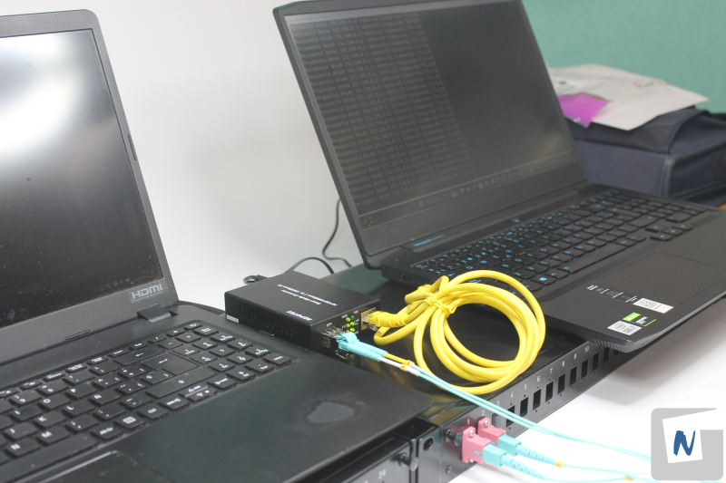

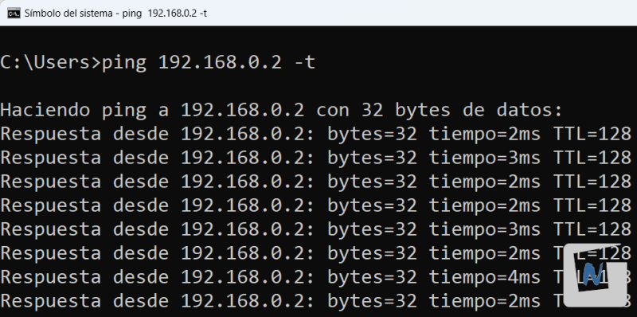