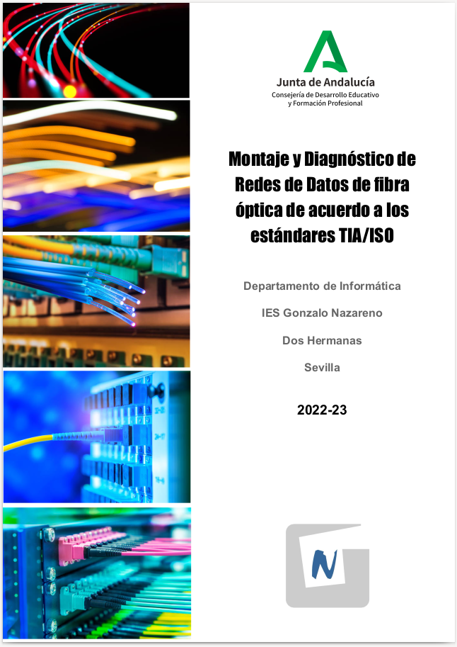

# Montaje y Diagnóstico de Redes de Datos de fibra óptica de acuerdo a los estándares TIA/ISO
### IES Gonzalo Nazareno
### Departamento de Informática (Dos Hermanas, Sevilla)
### 2022-23

1. [P01. Introducción a la Fibra Óptica y sus principales medidas de protección y seguridad](P01/README.md)
2. [P02. Empalme por fusión de dos fibras](P02/README.md)
3. [P03. Fusionado de pigtail](P03/README.md)
4. [P04. Terminación cable fibra óptica en bandeja de 19"](P04/README.md)
5. [P05. Prueba de enlace en fibra óptica](P05/README.md)
6. [P06. Medición de pérdidas en fibra óptica](P06/README.md)
7. [P07. Utilización del convertidor de medios](P07/README.md)
8. [Anexo: Materiales](materiales.md)
9. [Anexo: Herramientas](herramientas.md)
