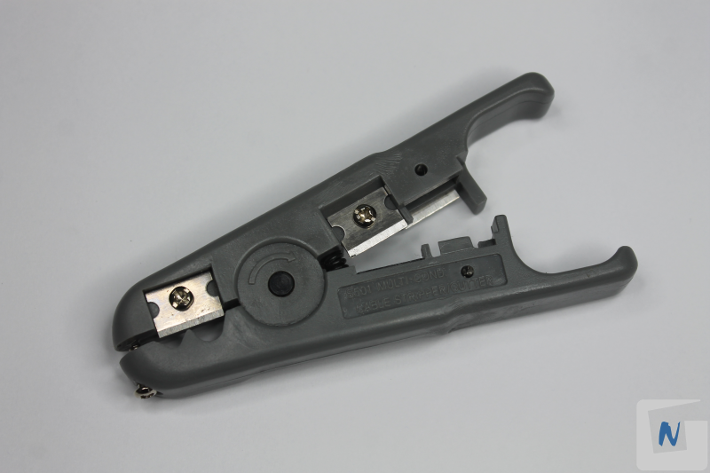

# Anexo: Herramientas

1. Fusionadora

    
    
    
2. Cuchilla de corte

    
3. Localizador visual de fallos (linterna láser)

    
4. Medidor de potencia de fibra óptica

    
5. Tijeras de Aramida

    
6. Peladora de fibra óptica

    
7. Pelacables

    
    