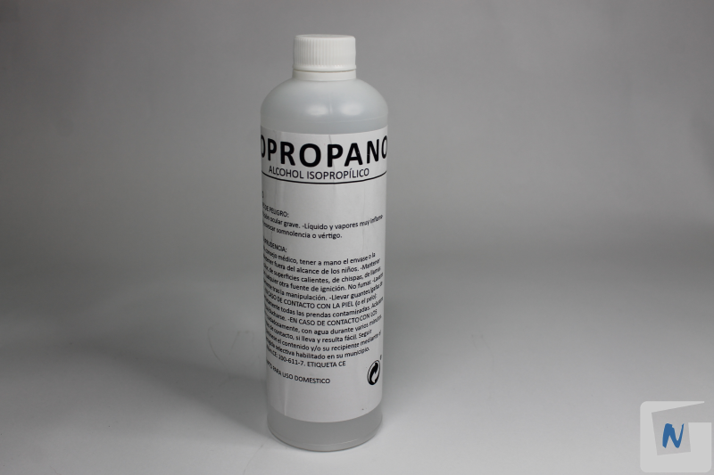

# Anexo: Materiales

1. Cable de fibra de un hilo multimodo
    
2. Cable holgado monotubo de 8 hilos de fibra multimodo
    
3. Pigtail SC
    
4. Latiguillos de fibra óptica SC
    
5. Latiguillo de fibra óptica SC-LC
    
6. Bandeja de fibra óptica de 19”
    
7. Acopladores bandeja de fibra óptica
    
8. Convertidor de medios
    
9. Transceptor de fibra óptica multimodo
    
10. Alcohol isopropílico
    
11. Dispensador alcohol
    
12. Toallitas 
    
13. Canutillos de protección
    
14. Bridas
    